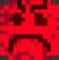

# Cells at Work!

## Why?

The project contained in this repository is our submission for the exam "Programming and Development Paradigms", part of the course "Computer Science and Engineering - LM" at "Alma Mater Studiorum - University of Bologna" for the academic year 2020 - 2021. This project has the acronym "caw" and its submission for approval was made on 2021-09-06. Its deadline has been chosen to be 2021-11-06.

## Who?

The members of the team behind the project are:

- Elena Rughi
- Lorenzo Gardini
- Matteo Castellucci
- Yuqi Sun

## What?

We developed a clone of the game "Cell Machine" by Sam Hogan (you can find it at this [link](https://samhogan.itch.io/cell-machine)) and partially on the mod developed on the game itself, "Cell Machine Mystic Mod". In a few words, the game is based on the concept of a "cellular automaton", an automaton based on a grid which is made of cells. Every cell has a state, which is determined by its neighborhood. The behavior of the automaton is completely deterministic and is determined by the initial state of the automaton itself and the rules for updating the grid. The simulation over the automaton is made by atomic steps that transform the current state into the next one and so on, to infinity.

## How (to play)?

### The game

The core mechanics are the same as the ones in "Cell Machine": in each level, you must arrange the cells inside a special area such that all enemy cells in the level are killed. There are five types of cells that can help you in your mission:

*  : the mover cell. It pushes forward by one square any cell in front of it which is not a rotator cell, a trash cell, a wall cell, a wrong block cell or another cell that can push in an opposite direction. It exists in four versions: a right one (like this one), a left one, a top one and a bottom one.
*  : the generator cell. It duplicates every cell that is behind it which is not an enemy cell. The generated cell is put in front of it, pushing all other cells forward by one cell following the same rules of the mover cell. It has four versions: a right one (like this one), a left one , a top one and a bottom one.
*  : the block cell. It can be simply pushed away. It can be pushed horizontally and vertically. There are two variants of this cell.
  *  : the horizontal block cell. It can be pushed only horizontally, it blocks every other cell pushing it vertically.
  *  : the vertical block cell. It can be pushed only vertically, it blocks every other cell pushing it horizontally.
*  : the rotator cell. It rotates every cell with a direction which happens to be next to it. It has two versions: a clockwise one (like this one) and a counterclockwise one.
*  : the deleter cell. It deletes every cell that is pushed onto it, with no exceptions.

The enemy cells to be destroyed look like this:  . Very intimidating!

We have ~~cloned~~ prepared 24 levels to be played right away, but you can also play your level. How can I create one, you may ask?

### The editor

One way to create your level is to use the level editor which is built-in. Just select the dimensions of your level, drag the cells from the bar below into the level, click and drag on the grid for drawing the special area, right click everything to delete it and you're good to go! You can also load an already created level, if you want to resume editing it from where you left it.

### The DSL

Yes, there is another way to create your level and it is by describing it with **words**. We created it so as to let the player describe the level in an english-like language written on top of scala. So, remember to have a scala compiler at hand for running your code. An example of the use of the DSL is the one below:

```scala
import CellsAtWorkDSL.*

@main
def main(): Unit =
  level {
    withDimensions (10, 10)
    hasPlayableArea withDimensions (4, 4) at (0, 0)
    hasMoverCell facing left at (1, 1)
    hasBlockCells inAnArea (2, 2) pushable horizontally at (3, 3)
    showIt
  }
```

There is a way to describe the presence of a single cell or a block of cells for each type of cell (including the elusive but existing wall cell)  and it exists the possibility to display the level on the command line, save it to file, play it in the game or edit it in the editor, all from the DSL itself!

## Acknowledgements

We thank Kevin MacLeod (incompetech.com) for letting us use its songs in our game. More precisely, the songs used are:

* Getting it done (in the editor)
* Pookatori and friends (during the game)

We thanks also [Loeder](https://www.youtube.com/channel/UCg4w2hQ-Bqn9Z4VhqrV8X9Q), a youtuber which realized the Master Kohga battle theme from "The Legend of Zelda - Breath of the Wild" in 8 bit, which we used in the menu. All the images used in the game are taken from "Cell Machine" and "Cell Machine Mystic Mod" and are sole property of their respective owners, we do not own any rights onto them.

## One last thing... What about the name?

Its a reference to a very famous [manga](https://en.wikipedia.org/wiki/Cells_at_Work!) first and anime then, titled with the same name. You know, both have cells, both have cells that move and work... Got it?
