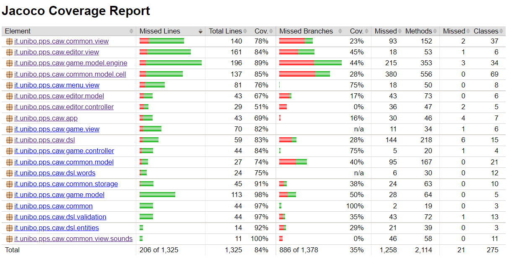

# Processo

Abbiamo adottato un processo di sviluppo "*Scrum inspired*": tale *framework* è adatto a *team* di piccole dimensioni e favorisce lo sviluppo di software che potrebbe presentare difficoltà inattese grazie al suo processo incrementale. Ciò è stato particolarmente utile nella realizzazione della nostra applicazione, poiché era il nostro primo progetto di dimensioni consistenti realizzato nel linguaggio "scala".

Il ruolo di "Product Owner" è stato ricoperto da Matteo Castellucci, che ha redatto e tenuto aggiornato il *product backlog*, ha condotto i vari *meeting*, ha creato gli *sprint backlog* e prodotto un piccolo *report* alla fine di ogni *sprint*.

## Meeting

Il processo "Scrum" si focalizza su collaborazione e *teamwork*: *meeting* giornalieri e settimanali incoraggiano discussione in itinere e favoriscono una profonda comprensione di ogni componente dell'applicazione da parte di ogni membro.

I *meeting* giornalieri hanno compreso i *daily scrum*, mentre i *meeting* settimanali sono stati simili a quelli giornalieri, ma un po' più lunghi, tali da incorporare il *product backlog refinement*, la *sprint retrospective* e lo *sprint planning*. Tutti questi sono stati svolti tramite l'applicazione di teleconferenza "Discord".

### Meeting giornalieri

Durante i *meeting* giornalieri, ogni membro, a turno, ha esposto:

- il codice che ha prodotto in quel giorno, motivandone le scelte implementative;
- la propria opinione su come intendeva proseguire il proprio lavoro;
- eventuali dubbi riguardo le scelte implementative adottate o l'integrazione con i componenti sviluppati dagli altri membri.

Dopo il *daily scrum*, per ciascun membro, seguiva una discussione più tecnica che entrava nel merito delle scelte implementative fatte e dei dubbi esposti, in maniera tale da migliorare le prime e dissipare i secondi con l'aiuto di tutti i membri del gruppo. Tipicamente il *meeting* durava dai quindici ai sessanta minuti, a seconda della complessità dei problemi e delle eventuali discussioni sorte in itinere.

### Meeting settimanali

Abbiamo svolto cinque *sprint* della durata di una settimana l'uno.

Ogni martedì, in seguito ai compiti del *meeting* giornaliero, abbiamo svolto il *product backlog refinement*, abbiamo fatto *retrospective* dello *sprint* appena concluso e abbiamo fatto *planning* dello *sprint* successivo.

Il *product backlog refinement* è consistito in:

* eliminare dal *product backlog* i *goal* già raggiunti con il completamento del precedente *sprint*;
* raffinare i *goal* già presenti nel *product backlog* parzialmente raggiunti;
* aggiungere al *product backlog* nuovi *goal* corrispondenti a nuove specifiche individuate;
* correggere le stime di dimensione e le priorità di tutti i *goal* a questo punto presenti nel *product backlog*.

La *sprint retrospective* è consistita in:

- analizzare il livello di completamento dello *sprint backlog*;
- individuare eventuali *task* che si sono rivelati più complessi o più semplici del previsto;
- discutere quali sono stati i problemi legati alla sottostima o alla sovrastima delle loro dimensioni, per poter distribuire meglio il carico di lavoro nello *sprint successivo*.

Lo *sprint planning* è consistito in:

- decidere quali *goal* avrebbero fatto parte dello *sprint* da iniziare;
- compilare un nuovo *sprint backlog* per realizzare i *goal* proposti.

Tipicamente, i *meeting* settimanali duravano tra le due e le tre ore, a seconda del tempo necessario per portare a termine ciascun compito.

## Suddivisione dei task

Gli *item* che hanno costituito ogni *sprint backlog* sono stati individuati suddividendo i *goal* da realizzare in *task* auto-contenuti e di piccole dimensioni che avevano lo scopo di realizzare tali *goal*. L'assegnazione dei *task* ai membri del *team* era consentita sia all'inizio degli *sprint* che durante, per uno sviluppo più flessibile.

## Tool

Gli strumenti e le tecnologie di cui ci siamo avvalsi durante lo sviluppo sono state le seguenti:

- il *framework* "ScalaTest" per realizzare la suite degli *unit test*.
- il *framework* "TestFx" per realizzare la suite degli *acceptance test*.
- il *framework* "JaCoCo" per analizzare la *code coverage* delle nostre *suite* di test.
- il *linter* "scalafmt" per formattare in modo uniforme il codice.
- il servizio online "Trello" per le sue *board* capaci di tenere traccia del *product backlog* e degli *sprint backlog*.

### Repository GitHub

Per facilitare lo sviluppo in parallelo dei *task* assegnati ad ogni membro del team, abbiamo utilizzato il DVCS "git" e organizzato il suo *workflow* nel seguente modo:

- il *branch* "main" è stato dedicato alle versioni principali dell'applicazione, rilasciate al termine di ogni *sprint*, e alla documentazione del processo di sviluppo;
- il *branch* "develop" è stato usato per unificare man mano le varie *feature* sviluppate, nonché per effettuare i *bug fix*;
- ogni *feature* ha avuto un proprio *branch* su cui hanno lavorato al massimo due persone contemporaneamente.

La decisione di fare *hosting* della *repository* sul servizio "GitHub" ci ha permesso di utilizzare la sua tecnologia di "*Continuous Integration*" per automatizzare il *workflow*, ovvero "GitHub Actions". Si elencano qui di seguito le *pipeline* adoperate:

- *release* per sistemi "Linux", "MacOS" e "Windows" in seguito alla creazione di un *tag* che indica una versione stabile;
- esecuzione dei test e controllo della formattazione del codice ad ogni push sui *branch* usati per lo sviluppo, ovvero tutti eccetto "main";
- produzione del *report* di *code coverage* ad ogni *push* sul *branch* "develop";
- generazione del presente *report* come file in formato PDF ad ogni *push* sul *branch* "main" nella cartella "report".

{ width=100% }
