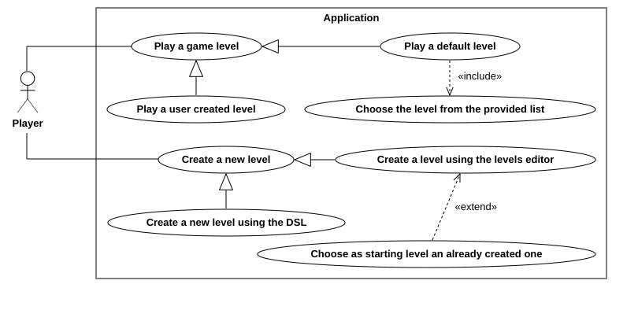

# Requisiti

## Requisiti di business

Come progetto volevamo replicare un gioco che fosse realizzabile in 60-80 ore come da richiesto dai requisiti d'esame. Di conseguenza, per la scelta del gioco abbiamo suggerito i seguenti propositi:
- Il gioco deve avere il giusto livello di complessità per dimostrare le conoscenze acquisite durante il corso e completarlo nel monte ore stabilito.
- Se possibile, la logica del gioco deve essere descritta con regole esprimibili tramite logica di primo ordine.
- La componente grafica deve essere semplice ma efficace; non deve distogliere da altri aspetti fondamentali quali l'architettura e l'implementazione.
- Se possible, deve avere un elemento di gioco sufficientemente semplice da essere descritto con un Domain-Specific Language (DSL), come la struttura del livello o la mappa di gioco.

 Tra le tante proposte che ci sono venute in mente, la scelta è ricaduta sul puzzle game "Cell Machine" di Sam Hogan e sulla sua mod "Cell Machine Mystic Mod", in quanto soddisfano tutti i nostri requisiti.
 
 L'idea del gioco è molto semplice: basato sul concetto di "cellular automaton", ogni livello è composto da una griglia bidimensionale di cellule, dotate di uno stato, capace di evolvere nel tempo sulla base di regole predefinite; usando il mouse, il giocatore deve spostare e riorganizzare le cellule a sua disposizione per eliminare quelle nemiche. Anche se le regole sono molto facili, le cellule, interagendo tra di loro, riescono a creare comportamenti più complessi, permettendo di risolvere livelli via via sempre più difficili. 
 
 Inoltre anche noi abbiamo voluto dare al giocatore non solo la possibilità di risolvere puzzle ma anche quella di creare nuovi livelli che possono essere condivisi e giocabili da altri giocatori, una caratteristica che mancava nel gioco originale ma che è presenta nella mod. Con questa aggiunta, speravamo di offrire un gioco intrattenente, coinvolgente e dall'alta rigiocabilità, in quanto si può essere giocatori ma anche creatori di livelli.

## Requisiti utente

## Requisiti funzionali

## Requisiti non funzionali

## Requisiti implementativi
