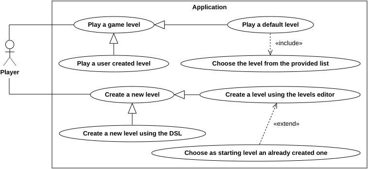
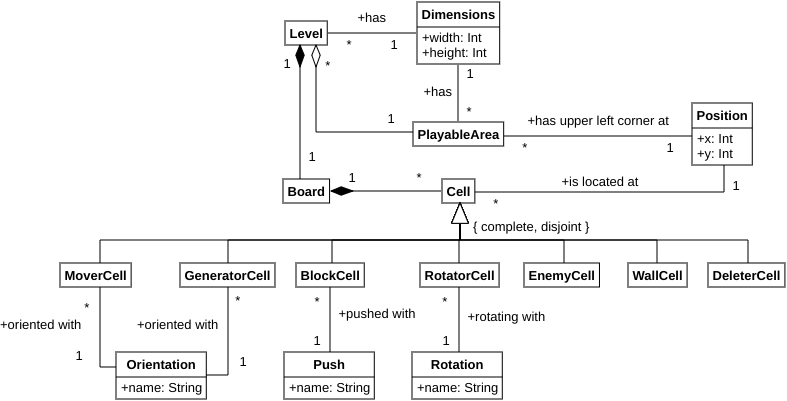

# Requisiti

## Requisiti di business

Come progetto ci si è proposti di replicare un gioco che fosse realizzabile in un tempo compreso tra le 60 e le 80 ore, come richiesto dalle regole d'esame. Di conseguenza, per la scelta del gioco, abbiamo imposto i seguenti requisiti:

- L'applicazione sviluppata deve avere il giusto livello di complessità, per poter dimostrare le conoscenze acquisite durante il corso, ma anche per poterla completare nel monte ore stabilito.
- La logica del gioco deve essere descrivibile nei termini di uno stato iniziale e di una funzione che permetta di calcolare, a partire dallo stato corrente del gioco, quello successivo, in modo tale che sia facilmente esprimibile tramite regole logiche.
- La componente grafica deve essere semplice ma efficace; non deve distogliere da altri aspetti fondamentali quali l'architettura e l'implementazione.
- Deve avere un elemento di gioco che possa essere adeguatamente descritto con un *Domain-Specific Language* (DSL), come, ad esempio, la struttura del livello o la mappa di gioco.

Tra le tante proposte che sono state vagliate, la scelta è ricaduta sul *puzzle game* "Cell Machine" di Sam Hogan e sulla sua *mod* "Cell Machine Mystic Mod", in quanto soddisfano tutti i nostri requisiti: "Cell Machine" è un gioco con il giusto grado di complessità sia implementativa sia grafica; le sue regole di gioco si possono esprimere in termini di stati e di evoluzione degli stessi e i suoi livelli possono essere descritti con un DSL.

L'idea dietro al gioco è molto semplice: è composto da più livelli, ognuno dei quali è un "*cellular automaton*", cioè un automa rappresentato da una griglia bidimensionale che contiene delle cellule, ognuna delle quali è dotata di uno stato e un comportamento specifici. Un livello evolve e cambia complessivamente di stato applicando le regole di gioco alle cellule contenute al suo interno, facendo perciò evolvere il loro stato secondo il loro comportamento. L'obiettivo del giocatore è spostare e organizzare le cellule secondo una disposizione che le renda capaci di eliminare tutte quelle nemiche. Anche se le regole, prese singolarmente, sono semplici, le cellule, interagendo tra loro, riescono a creare comportamenti più complessi, permettendo di creare livelli via via sempre più difficili.

Inoltre, si è voluto dare al giocatore non solo la possibilità di risolvere i *puzzle* proposti dal gioco, ma anche quella di creare nuovi livelli che possono essere condivisi e giocati da altri giocatori, una caratteristica che mancava nel gioco originale ma che è presente nella *mod*. Con questa aggiunta, speravamo di offrire un gioco capace di intrattenere, coinvolgente e dall'alta rigiocabilità, in quanto si può essere giocatori ma anche creatori di livelli.

## Requisiti utente

Un utente ha le seguenti richieste che vuole vedere realizzate nel prodotto finale.

### Giocare un livello

Il giocatore vuole che l'esperienza di gioco sia il più simile possibile a quella di "Cell Machine", cioè vuole:

- avere a disposizione tutte le cellule presenti nel gioco originale, più la cellula *Deleter* aggiunta nella *mod*;
- vedere come il comportamento delle cellule durante l'evoluzione del livello sia quanto più simile possibile a quello nel gioco originale.

Mentre gioca ad un livello, il giocatore vuole:

- fare "*drag and drop*" delle cellule contenute in un'area predefinita del livello in posizioni libere della stessa area;
- visualizzare l'evoluzione del livello in due modalità distinte:
    - aggiornamento automatico del livello;
    - aggiornamento passo passo del livello.
- resettare il livello, portando le cellule nelle posizioni precedenti all'inizio della sequenza di aggiornamento;
- avere la possibilità di ritornare al menu iniziale;
- avere la possibilità di passare al livello successivo, se quello corrente è stato completato e il successivo esiste.

### Creare un livello

Per creare un livello, il giocatore vuole:

- utilizzare il DSL, dove può:
    - definire le dimensioni del livello;
    - definire l'area giocabile del livello specificandone la dimensione e la posizione;
    - aggiungere le cellule singolarmente specificandone le caratteristiche e la posizione;
    - aggiungere aree di cellule con le stesse caratteristiche specificandone le dimensioni e la posizione;
    - salvare il livello creato in un file il cui percorso è specificato dal giocatore stesso;
    - visualizzare a riga di comando il livello creato;
    - giocare al livello creato;
    - modificare tramite l'*editor* il livello creato.
- utilizzare l'*editor* di livelli, dove può:
    - avviare l'*editor* con un livello precedentemente creato;
    - avviare l'*editor* con un livello vuoto, ovvero di cui vengono specificate unicamente le dimensioni;
    - modificare l'area giocabile, cioè:
        - definire un'area giocabile rettangolare mediante interazione di tipo "*drag and drop*" nel livello;
        - rimuovere l'area giocabile già definita con il tasto destro del mouse.
    - modificare le cellule già inserite, cioè:
        - fare "*drag and drop*" delle cellule presenti attualmente nel livello verso qualunque altra posizione libera;
        - rimuovere una cellula con il tasto destro del mouse.
    - resettare il livello, eliminando tutte le cellule già inserite e l'area giocabile già definita;
    - utilizzare il *dispenser* di cellule che include:
        - fare "*drag and drop*" delle cellule dal *dispenser* nelle posizioni libere del livello;
        - trasformare le cellule attualmente presenti nel *dispenser* per ottenere ogni possibile variante delle stesse.
    - salvare il livello corrente in un file il cui percorso è specificato dal giocatore stesso;
    - visualizzare le regole di funzionamento dell'*editor*;
    - ritornare al menu iniziale.

### Musica ed effetti sonori

Il giocatore vuole che il gioco abbia musica di sottofondo ed effetti sonori. Dunque, nelle impostazioni vuole poter:

- impostare il volume della musica;
- impostare il volume degli effetti sonori;
- ritornare al menu iniziale.

### Utilizzo del menu iniziale

Il giocatore vuole un menu iniziale che gli permetta di:

- accedere alla schermata dei livelli offerti di default dall'applicazione tra cui scegliere il livello da giocare;
- accedere al menu dell'*editor* di livelli che gli permetta di:
    - aprire l'*editor* con un livello vuoto di cui ha specificato solamente le dimensioni;
    - aprire l'*editor* scegliendo un livello precedentemente creato.
- scegliere e giocare ad un livello precedentemente creato dal giocatore stesso;
- accedere alla schermata delle impostazioni;
- chiudere il gioco.

{ width=100% }

Infine, il giocatore non vuole che l'applicazione sia lenta o che abbia errori che bloccano il suo utilizzo.

## Requisiti funzionali

A partire dai requisiti utente, sono stati formulati i seguenti requisiti funzionali:

- Il giocatore deve poter giocare ad uno o più livelli.
    - Il giocatore deve poter giocare ai livelli che l'applicazione fornisce di default.
    - Il giocatore deve poter giocare ad un livello singolo da lui creato o creato da terzi.
- Il gioco deve avere tutte le cellule del gioco originale, ovvero le cellule di tipo:
    - "Mover", capaci di spostare le cellule di fronte ad esse di una posizione;
    - "Generator", capaci di generare di fronte ad esse la cellula posta dietro di loro;
    - "Block", capaci di essere spostate da altre cellule;
    - "Rotator", capaci di ruotare la direzione delle cellule adiacenti;
    - "Enemy", le cellule nemiche da eliminare;
    - "Wall", che non possono essere spostate;
    - "Deleter", capaci di eliminare qualsiasi cellula che viene spinta contro di esse.
- Il giocatore deve poter utilizzare un *editor* per i livelli.
    - Il giocatore deve poter creare un nuovo livello inizialmente vuoto, specificando solo le dimensioni.
    - Il giocatore deve poter modificare un livello creato in precedenza.
- L'applicazione deve essere dotata di un menu iniziale capace di accedere a tutti i servizi che l'applicazione offre.
- L'applicazione deve avere musiche di sottofondo ed effetti sonori.
- Il giocatore deve poter utilizzare un DSL con il quale creare un nuovo livello e salvarlo su file.

Di seguito, si presenta una descrizione dettagliata di ciascuno dei precedenti requisiti.

### Gioco

1. Il gioco fornisce al giocatore la possibilità di giocare ad uno o più livelli.
    1. Il giocatore può decidere di giocare ai livelli che vengono forniti di default dall'applicazione.
    2. Ciascun livello "di default" è parte di un'unica sequenza.
    3. Ciascun livello "di default" è univocamente identificato dall'indice che possiede nella sequenza.
    4. Il giocatore può decidere di giocare ad un singolo livello creato da lui o qualche altro giocatore.
2. Un livello possiede una specifica larghezza e una specifica altezza.
3. Un livello contiene una griglia bidimensionale le cui dimensioni sono le stesse del livello. 
    1. Diversamente dal classico piano cartesiano, il sistema di coordinate della griglia ha l'origine in alto a sinistra e l'asse delle ordinate cresce verso il basso.
    2. All'interno della griglia sono posizionate le cellule di gioco.
    3. Ogni cellula deve avere una posizione univoca all'interno della griglia, perciò due cellule distinte non possono avere la stessa posizione.
4. Un livello è sempre circondato da un perimetro fatto di cellule "Wall".
5. Un livello deve avere una sola area di gioco.
    1. Un'area di gioco è una sotto-area rettangolare del livello in cui cellule possono essere spostate.
    2. Un'area di gioco è dotata di una specifica larghezza e una specifica altezza.
    3. Un'area di gioco è dotata di una posizione, che è la coordinata dell'angolo in alto a sinistra nel sistema di coordinate della griglia del livello.
    4. Il giocatore può spostare le cellule contenute nell'area di gioco in una posizione diversa, ma sempre interna all'area di gioco.
    5. Il giocatore non può spostare le cellule posizionate al di fuori dell'area di gioco.
    6. L'area di gioco deve essere evidenziata per distinguerla dalla restante area del livello.
6. L'obiettivo del gioco in ciascun livello è uccidere tutte le cellule "Enemy" presenti al suo interno, in tal caso il livello si dice "completato".
7. Il gioco deve prevedere due fasi distinte: la fase di "setup" e la fase di "play".
    1. Nella fase di "setup", il giocatore può riorganizzare le cellule posizionate all'interno dell'area di gioco come descritto sopra.
    2. Una volta decisa una certa disposizione delle cellule, il giocatore ha la possibilità di far partire la simulazione del gioco, dando inizio alla fase di "play".
    3. Una "simulazione" è l'evolversi dello stato del livello secondo le regole del gioco.
        1. L'evoluzione avviene modificando lo stato di ciascuna delle cellule del livello attraverso l'applicazione delle regole di gioco.
        2. Solamente la modifica dello stato delle cellule "Mover", "Generator" e "Rotator" contribuisce a modificare lo stato del livello, dacché sono le uniche che hanno un comportamento che ha effetto anche sulle cellule a loro adiacenti.
        3. Per effettuare uno "step" della simulazione, si applica la modifica dello stato prima alle cellule "Generator", poi alle cellule "Rotator" e infine alle cellule "Mover".
        4. Dato un gruppo di cellule dello stesso tipo, la modifica dello stato avviene considerando la cellule da sinistra verso destra e dall'alto verso il basso.
        5. L'evoluzione della simulazione si interrompe nel momento nel quale il livello è "completato".
    4. Durante la fase di "play", nessuna cellula può essere spostata dal giocatore.   
8. Il giocatore deve avere la possibilità di visualizzare l'avanzamento della simulazione.
    1. L'avanzamento può essere visualizzato passo passo, cioè l'utente decide quando vuole fare avanzare la simulazione. 
    2. L'avanzamento può essere visualizzato in maniera continuativa, cioè l'utente decide quando far iniziare l'avanzamento e poi gli "step" avvengono con una cadenza prefissata.
    3. Così come l'avanzamento può essere avviato perché avanzi automaticamente, questo può anche essere messo in pausa.
    4. Mentre l'avanzamento è in pausa, l'utente può decidere di farlo continuare scegliendo uno qualsiasi dei due metodi descritti sopra.
9. Il giocatore deve avere la possibilità di riportare il livello allo stato immediatamente precedente all'inizio della fase di "play".
    1. Questa operazione è detta "reset" del livello.
    2. Compiendo questa operazione, il gioco torna alla fase di "setup".
10. Quando un livello è "completato", deve essere mostrata al giocatore l'opzione per giocare il livello successivo.
    1. Se l'utente decide di passare al livello successivo ad uno "di default" e questo esiste, deve passare al successivo.
    2. Se l'utente decide di passare al livello successivo ad uno "di default" e questo non esiste, il gioco deve chiudersi.
    3. Se l'utente decide di passare al livello successivo ad uno da lui creato, il gioco deve chiudersi.
11. La schermata di gioco deve sempre offrire la possibilità al giocatore di tornare al menu iniziale.

### Regole del gioco

1. Una cellula si dice adiacente ad un'altra se le loro posizioni distano di uno secondo la distanza L1, perciò non sono adiacenti se sono in diagonale l'una rispetto all'altra.
2. L'intorno di una cellula è l'insieme delle cellule che possono venire influenzate dal comportamento della cellula stessa.
3. I tipi di cellule sono: "Mover", "Generator", "Block", "Rotator", "Enemy", "Wall" e "Deleter".
4. Sia le cellule "Mover" che le cellule "Generator" possiedono un orientamento.
    1. L'orientamento può essere: "right", "left", "top" o "bottom".
    2. Il "fronte" della cellula è la posizione adiacente alla cellula indicata dall'orientamento.
    3. Il "dietro" della cellula è la posizione adiacente alla cellula opposta all'orientamento.
5. Una cellula "Mover" si può muovere di una posizione nella direzione data dal suo orientamento.
    1. Se la cellula "Mover" di fronte a sè non ha cellule, può sempre muoversi.
    2. Se la cellula "Mover" di fronte a sè ha delle cellule, le può spostare, purché queste abbiano uno spostamento "compatibile" con quello del "Mover".
        1. Una cellula "Mover" non può spostare una cellula "Generator" o una cellula "Mover" se queste hanno un orientamento opposto.
        2. Una cellula "Mover" non può spostare un "Rotator" se l'ha di fronte, può farlo se ha almeno una cellula diversa da un "Rotator" di fronte a sua volta adiacente al "Rotator".
        3. Una cellula "Mover" non può mai spostare un "Wall", un "Deleter" o un "Enemy".
        4. Una cellula "Mover" non può spostare una cellula "Block" se questa non può essere spostata secondo lo stesso orientamento del "Mover".
    3. Se di fronte a sè ha delle cellule e queste non possono essere spostate, la cellula "Mover" non si muove.
6. Una cellula "Generator" può generare un'altra cellula nella posizione di fronte a sè.
    1. La cellula "Generator" può generare se dietro al "Generator" è presente un'altra cellula.
    2. La cellula che viene generata è un clone di quella dietro alla cellula "Generator".
    3. Se la cellula "Generator" di fronte a sè non ha cellule, può generare.
    4. Se la cellula "Generator" di fronte a sè ha delle cellule, le può spostare di una posizione, purché queste abbiano uno spostamento "compatibile" con quello del "Generator".
        1. Una cellula "Generator" non può spostare una cellula "Generator" o una cellula "Mover" se queste hanno un orientamento opposto.
        2. Una cellula "Generator" non può spostare un "Rotator" se l'ha di fronte, può farlo se ha almeno una cellula diversa da un "Rotator" di fronte a sua volta adiacente al "Rotator".
        3. Una cellula "Generator" non può mai spostare un "Wall", un "Deleter" o un "Enemy".
        4. Una cellula "Generator" non può spostare una cellula "Block" se questa non può essere spostata secondo lo stesso orientamento del "Generator".
    4. Se di fronte a sè ha delle cellule e queste non possono essere spostate, la cellula "Generator" non può generare.
    5. Non possono essere generate cellule "Enemy".
7. Una cellula "Block" può essere spinta di una posizione da altre cellule capaci di muoverla.
    1. Lo spostamento proprio di una cellula "Block" può essere: "orizzontale", "verticale" o "sia orrizontale che verticale".
    2. Una cellula "Block" può essere spinta solamente in una direzione compatibile con il suo spostamento.
8. Una cellula "Rotator" può ruotare tutte le cellule adiacenti ad essa.
    1. La rotazione effettuata può essere in senso orario o antiorario, a seconda della cellula "Rotator".
    2. La rotazione ha effetto solamente sulle cellule che possiedono un orientamento o una direzione di spostamento "verticale" o "orizzontale"
9. Una cellula "Enemy" è una cellula che deve essere eliminata dal giocatore.
    1. Una cellula "Enemy" viene eliminata dalla griglia nel momento nel quale la posizione di un'altra cellula dovrebbe sovrapporsi alla sua.
    2. Anche la cellula che si sarebbe dovuta sovrapporre alla cellula "Enemy" deve essere eliminata dalla griglia.
10. Una cellula "Wall" è una cellula che non si muove.
    1. Non può essere spostata né da una cellula "Generator" né da una cellula "Mover".
    2. Solamente il giocatore può cambiare la posizione di una cellula "Wall", ma solo se questa è posizionata nell'area di gioco e se ci si trova nella fase di "setup".
11. Una cellula "Deleter" è in grado di eliminare altre cellule dalla griglia.
    1. Se una cellula viene spostata in modo tale che la sua posizione si dovrebbe sovrapporre a quella della cellula "Deleter", la prima viene rimossa dalla griglia.
    2. Se una cellula "Deleter" viene generata da una cellula "Generator" e di fronte al "Generator" è presente una cellula, questa viene eliminata dalla cellula "Deleter" generata, che ne occupa la posizione.

{ width=100% }

### Editor

1. L'*editor* di livelli deve permettere di creare un nuovo livello vuoto, di cui il giocatore fornisce inizialmente solo le dimensioni iniziali.
2. L'*editor* di livelli deve permettere di modificare un livello già creato dal giocatore o da giocatori terzi.
3. Ogni livello creato tramite l'*editor* è circondato da un perimetro di cellule "Wall" che non possono essere rimosse.
4. L'*editor* deve mettere a disposizione del giocatore un dispenser con tutti i tipi di cellule che il giocatore può aggiungere al livello.
    1. Il dispenser deve mettere a disposizione del giocatore la possibilità di ruotare le cellule al suo interno per ottenere ogni possibile loro variante.
    2. Il dispenser permette di collocare una cellula tramite un'interazione di tipo "*drag and drop*" sulla griglia del livello.
    3. Ogni nuova cellula inserita nella griglia del livello non può essere collocata dove è già presente una cellula.
5. Il giocatore deve poter aggiungere un'area di gioco al livello, se non è già presente, tramite un'interazione di tipo "*drag and drop*" con la griglia del livello.
6. Cliccando con il tasto destro sull'area di gioco già disegnata all'interno del livello, il giocatore può rimuoverla.
7. Il giocatore deve poter trascinare una cellula già inserita all'interno della griglia in una qualsiasi altra posizione della stessa, purché libera.
8. Cliccando con il tasto destro su una cellula già inserita all'interno della griglia, il giocatore può rimuoverla.
9. Il giocatore deve poter svuotare il livello di tutto il suo contenuto, cellule e area di gioco, effettuandone il "reset".
10. L'utente deve poter salvare il livello che ha disegnato nell'*editor* in un file il cui percorso è fornito da lui stesso.
11. In caso il livello cerchi di essere salvato senza avere specificato un'area di gioco, deve essere visualizzato a video un messaggio d'errore.
12. La schermata dell'*editor* deve sempre offrire la possibilità al giocatore di tornare al menu iniziale.

### Menu

1. Al suo avvio, l'applicazione deve mostrare un menu con le opzioni tra cui il giocatore può scegliere.
2. Il giocatore deve poter scegliere di visualizzare la lista dei livelli offerti di default dall'applicazione.
    1. L'applicazione deve fare persistenza dei livelli completati dal giocatore, perché il giocatore possa tenere traccia di quelli che ha completato attraverso le varie aperture e chiusure dell'applicazione.
    2. Quando l'applicazione mostra la lista dei livelli offerti di default, deve evidenziare quali sono i livelli completati.
    3. I livelli offerti di default sono sempre tutti a disposizione del giocatore perché li possa scegliere per giocare, nessuno deve essere "bloccato".
    4. Nella stessa schermata in cui il giocatore può vedere la lista dei livelli offerti di default gli deve anche essere permesso di tornare al menu iniziale.
3. Il giocatore deve poter scegliere di giocare ad un livello creato da egli stesso o da terzi caricandolo da file.
4. Il giocatore deve poter scegliere di aprire il menu iniziale dell'*editor* di livelli.
    1. Il menu iniziale dell'*editor* di livelli deve permettere di caricare da file un livello già esistente per permettere di modificarlo tramite l'*editor*.
    2. Il menu iniziale dell'*editor* di livelli deve permettere di creare un nuovo livello vuoto specificandone solamente le dimensioni.
    3. Il menu iniziale dell'*editor* di livelli deve permettere di tornare al menu iniziale.
5. Il giocatore deve poter accedere alle impostazioni per modificare il volume della musica e degli effetti sonori.
    1. L'applicazione deve mostrare il valore corrente del volume della musica e del volume degli effetti sonori.
    2. L'applicazione deve fare persistenza del volume della musica e del volume degli effetti sonori scelti dal giocatore, perché il giocatore non percepisca variazioni degli stessi attraverso le varie aperture e chiusure dell'applicazione.
    3. Nella pagina che permette di visualizzare e modificare le impostazioni, deve essere possibile tornare al menu principale.
    4. Dovranno essere presenti tre temi musicali: uno per il menu, uno per il gioco e uno per l'*editor* di livelli.
    5. Un effetto sonoro deve essere riprodotto in corrispondenza di ciascuno dei seguenti eventi durante la fase di "play":
        - l'evoluzione della simulazione avanza di uno "step";
        - una cellula "Enemy" viene uccisa;
        - il livello viene completato.
6. Il giocatore deve poter uscire dall'applicazione.

### Domain-Specific Language

1. Il DSL deve essere realizzato in modo tale che assomigli alla lingua inglese.
2. Il DSL deve permettere di creare un nuovo livello.
    1. Il DSL deve permettere di specificare le dimensioni del nuovo livello.
    2. Il DSL deve permettere di aggiungere al nuovo livello l'area di gioco.
        1. Il DSL deve permettere di specificare la dimensione dell'area di gioco.
        2. Il DSL deve permettere di specificare la posizione in cui collocare l'area di gioco.
    3. Il DSL deve permettere di aggiungere una cellula nella griglia del nuovo livello.
        1. Il DSL deve permettere di specificare la posizione della cellula.
        2. Il DSL deve permettere di specificare l'orientamento se quella da inserire è una cellula "Mover" o una cellula "Generator".
        3. Il DSL deve permettere di specificare la rotazione se quella da inserire è una cellula "Rotator".
        4. Il DSL deve permettere di specificare la direzione di spostamento se quella da inserire è una cellula "Block".
    4. Il DSL deve permettere di aggiungere un'area di cellule tutte con le stesse caratteristiche.
        1. Il DSL deve permettere di specificare l'orientamento se quella prototipo da inserire è una cellula "Mover" o una cellula "Generator".
        2. Il DSL deve permettere di specificare la rotazione se quella prototipo da inserire è una cellula "Rotator".
        3. Il DSL deve permettere di specificare la direzione di spostamento se quella prototipo da inserire è una cellula "Block".
        4. Il DSL deve permettere di specificare la dimensione e la posizione, intesa come angolo in alto a sinistra, dell'area che deve essere collocata.
3. Il DSL deve permettere di salvare il livello creato su file in formato JSON.
4. Il DSL deve permettere di visualizzare il livello creato in formato JSON a riga di comando.
5. Il DSL deve permettere di giocare al livello creato aprendo il gioco.
6. Il DSL deve permettere di modificare il livello aprendo l'*editor* di livelli.
4. Il DSL deve gestire gli errori nella creazione del livello quando il giocatore decide di volerlo visualizzare, salvare o aprire altrove.
    1. Al giocatore deve essere notificato un errore nel caso in cui al livello non sia stata specificata alcuna dimensione.
    2. Al giocatore deve essere notificato un errore nel caso in cui l'area di gioco sia assente.
    3. Al giocatore deve essere notificato un errore nel caso in cui l'area di gioco non sia interamente contenuta nel livello.
    4. Al giocatore deve essere notificato un errore nel caso in cui una cellula venga posizionata al di fuori dei limiti del livello.
    5. Al giocatore deve essere notificato un errore nel caso in cui due o più cellule abbiano la stessa posizione.

## Requisiti non funzionali

- L'applicazione deve essere *cross-platform*, cioè eseguibile sia su Windows versione 10 20H2, sia su MacOS versione 10.13.6, che su Linux versione 5.14.13, o comunque su qualsiasi sistema operativo capace di supportare *Java Runtime Environment* versione 16 e successive.
- L'applicazione deve essere sufficientemente modulare in modo tale da essere possibile riusare i suoi componenti in contesti diversi senza problemi. Non ci devono essere dipendenze tra le classi dei componenti, ma solo verso interfacce liberamente re-implementabili.
- L'applicazione non deve mai interrompersi qualora si verifichi un errore; deve invece mostrare un messaggio di errore all'utente.
- L'applicazione deve essere fluida, cioè non presentare *stuttering* o *freezing*, su una macchina con requisiti minimi di 4GB di RAM e processore Dual Core 1.40GHz (AMD E1-2500 APU).

## Requisiti implementativi

- L'implementazione dell'applicazione deve essere fatta nel linguaggio "Scala", con compatibilità garantita con la versione 3.0.2.
- Deve essere sfruttato lo strumento di *build automation* "Scala Build Tool" versione 1.5.5 per automatizzare la compilazione, il *testing* e il *deployment* degli artefatti rilasciati.
- Lo sviluppo deve avvenire attingendo quanto più possibile al paradigma di programmazione funzionale.
- L'implementazione della logica di gioco deve essere fatta nel linguaggio PROLOG, sfruttando la libreria "TuProlog" versione 3.3.0.
- Il processo di sviluppo deve essere "*Scrum inspired*", con sprint della durata di una settimana.
- L'andamento dello sviluppo deve essere tracciato attraverso le *board* offerte dal software online "Trello".
- L'applicazione deve essere sviluppata utilizzando la tecnica di "Test-Driven Development" ove possibile, utilizzando le librerie "ScalaTest" versione 3.2.9 e "TestFX" versione 4.0.16-alpha per realizzare la *suite* di test.
- Deve essere monitorata la *coverage* dei test attraverso l'utilizzo della libreria "JaCoCo" versione 3.3.0.
- La repository deve essere gestita attraverso il DVCS "git" e mantenuta sul servizio di hosting "GitHub".
- Deve essere sfruttata la tecnologia offerta da "GitHub" per effettuare "*Continuous Integration*", ovvero "GitHub Actions".
