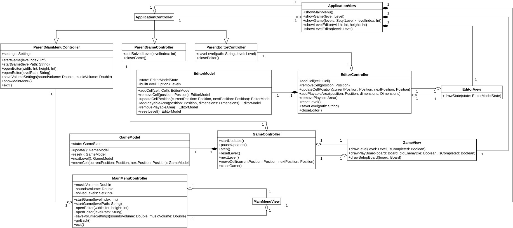

# Design

## Design architetturale

L'architettura dell'applicazione sviluppata si è basata su "Model-View-Controller", essendo questo il pattern architetturale di riferimento per le applicazioni dotate di interfaccia grafica. La sua pura e semplice attuazione, dividendo l'applicazione in tre componenti, però, non avrebbe potuto soddisfare i requisiti di modularità che ci erano stati richiesti. Per questo motivo si è deciso di dividere l'architettura ortogonalmente in quattro componenti principali. Il primo è quello più semplice, "Application", che rappresenta l'applicazione nel suo complesso. È costituito solamente dalle sotto-componenti "*controller*" e "*view*", che fanno da "genitori" per tutte le altre sotto-componenti analoghe degli altri tre componenti. Il sotto-componente "*model*" in questo caso è assente dato che si è voluto segregare completamente il modello dei dati di ciascun componente. Unica eccezione è il modello del dominio, che è comune a tutti, ed è per questo poco rilevante per quanto riguarda l'architettura dell'applicazione nel suo complesso.

Il legame di parentela tra sotto-componenti, per quanto riguarda il *controller* del componente "Application", si traduce nella necessità di tutti gli altri *controller* che hanno bisogno di servizi che non possono o non devono essere capaci di fornire da soli di fare riferimento per questi al loro genitore. In questo modo si osserva il principio di "*dependency inversion*", dove le effettive implementazioni dei *controller* dipenderanno dall'interfaccia fornita dal loro genitore e niente altro. Per quanto riguarda la *view*, invece, dato che i servizi di cui una *view* necessita sono sempre forniti dal suo *controller* associato, questa relazione di genitorialità si manifesta nella capacità di creare nuove *sub-view* di qualsiasi tipo a richiesta, permettendo il passaggio visuale da una componente all'altra dell'applicazione sotto controllo dell'utente. Questo significa che deve esporre dei metodi per mostrare il menu principale, per far mostrare l'interfaccia di gioco per giocare un solo livello o per giocare ad una sequenza di livelli partendo da uno di essi oppure mostrare l'interfaccia dell'editor per modificare un livello nuovo, vuoto, oppure uno già creato in precedenza. Ulteriore indipendenza tra i componenti è garantita dal fatto che, pur essendo dipendenti da un *controller* genitore che fornisce loro servizi, questi non dipendono dallo stesso tipo di *controller*, ma da un *controller* genitore che sia ritagliato sulle loro esclusive necessità, applicando il principio di "*interface segregation*". In questo modo, qualsiasi altro software voglia dotarsi dei componenti di seguito elencati, non necessita di doversi comporre anche del componente "Application", ma semplicemente gli basterà sostituirsi ad esso aderendo all'interfaccia che definisce i servizi che il componente di cui si vuole dotare ha bisogno.

Il secondo componente dell'applicazione è quello "Game", relativo al gioco vero e proprio che può essere giocato attraverso l'applicazione. È uno dei componenti più complessi e, in quanto tale, possiede sia un sotto-componente "*controller*", sia uno "*view*", sia uno "*model*". Il *model* del gioco, dovendo modellare il comportamento del gioco, la sua *business logic*, dovrà mantenere uno stato, che contiene tutte le informazioni sulle condizioni correnti del gioco e permette di decidere quali saranno i suoi futuri cambiamenti. Inoltre, così come da specifiche, deve essere possibile richiedere l'aggiornamento delle condizioni del gioco per poterne eseguire un "passo", indipendentemente che sia stato richiesto direttamente dall'utente o automaticamente dall'applicazione. Si deve poter passare al livello successivo, resettare lo stato del gioco corrente a come era prima di iniziare la seconda fase di ogni livello, ovvero quella dove l'utente non ha più facoltà di modificare lo stato del gioco corrente ma può solo osservarne l'evoluzione. Infine, il *model* permette di muovere le cellule dalla posizione in cui si trovano ad un'altra libera, così da permettere all'utente di effettuare la prima fase del gioco, quindi quella di sistemazione dello stato iniziale della griglia di gioco.

Il *controller* del componente "Game", dunque, dovrà esporre i servizi offerti dal *model* esattamente come le specifiche richiedono. Questo si traduce nel fatto che il *controller* permette, così come lo permette anche il *model*, di spostare le cellule nella griglia, così da permettere la prima fase del gioco, di riportare le condizioni del livello a quelle iniziali, ovvero prima di richiedere gli aggiornamenti che costituiscono la seconda fase del gioco, e di passare al livello successivo. Il *controller* però permette anche di richiedere l'aggiornamento delle condizioni del gioco di un solo "*step*", in modo tale che sia facoltà dell'utente di decidere se e quando aggiornare lo stato del gioco, ma anche di lasciare che gli aggiornamenti avvengano in maniera automatica dopo una prima richiesta dell'utente stesso. Inoltre, così come gli aggiornamenti automatici possono essere fatti partire, possono anche essere sospesi. Infine, il *controller* permette anche di uscire dal gioco, richiesta che necessariamente fatta pervenire verso il *controller* genitore, dato che è il componente di più alto livello a decidere quale nuova *view* sarà mostrata all'uscita del gioco. È importante sottolineare anche il fatto che, ogni volta che l'utente chiede di passare al prossimo livello, questo significa che ha completato quello corrente, perciò è bene annotare questo fatto in maniera che l'utente possa poi vedere dal menu principale quali livelli ha già giocato e completato e quali invece restano da completare. Essendo un operazione che richiede persistenza, è stato deciso di propagare l'operazione al sotto-componente genitore così da mantenere questo tipo di operazioni tutte concentrate in un unico punto.

La *view* del componente "Game" invece dovrà permettere di visualizzare sia gli effetti delle azioni del giocatore sul gioco stesso, sia gli aggiornamenti del mondo di gioco secondo l'applicazione delle regole del gioco stesso ad ogni "*step*". Per questo motivo dovrà essere possibile disegnare una griglia di gioco durante la prima fase, quella di "*setup*", che verrà richiesto ogniqualvolta occorra ridisegnare da zero una griglia di quel tipo, ovvero dopo una richiesta di "*reset*" da parte del giocatore. Inoltre, sempre per la stessa ragione, deve essere possibile disegnare una griglia di gioco durante la seconda fase, cosiddetta di "*play*", ad esempio ogni volta che avviene un aggiornamento delle condizioni di gioco. Assieme alla griglia è necessario indicare altre informazioni che si vogliono mostrare attraverso la *view*, cioè se il livello è stato completato o no, per permettere all'utente di avanzare a quello successivo, e se un nemico è stato ucciso, per renderlo partecipe che è ora necessario eliminare un nemico in meno per completare il livello. Ad ogni avanzamento di livello, così come quando viene avviato per la prima volta il gioco, è necessario disegnare il livello per intero e assieme al livello occorre notificare il fatto per cui il livello è stato già completato oppure no, in modo tale da non permettere all'utente di giocare un livello che di fatto non può essere giocato.

Il terzo componente è "Editor", quello relativo all'*editor* di livelli. Anche questo componente è a sua volta costituito da un sotto-componente "*model*", uno "*controller*" e uno "*view*". Il *model* deve trattenere lo stato corrente del processo di costruzione del livello, in modo tale da poter estrarre dalle informazioni ricevute il livello costruito, se possibile, così da poterlo fare persistere su richiesta dell'utente. Le operazioni che possono essere fatte all'interno dell'*editor* sono quelle di aggiungere o rimuovere una cellula in una data posizione, spostare una cellula da una posizione ad un'altra, aggiungere o rimuovere l'area di gioco dal livello e infine di fare un'operazione di "*reset*", svuotando il livello di tutto ciò che conteneva in precedenza. Ognuna delle operazioni è stata tradotta in un metodo dell'entità "model". Il componente "*controller*" espone tutte le precedenti operazioni del *model* in modo tale che la *view* possa permettere all'utente di eseguirle, più l'operazione per salvare un livello in un file dato il suo percorso e quella per chiudere l'*editor* e tornare indietro. Queste due operazioni vengono poi demandate al *controller* genitore di questo componente. Questo perché, per la prima operazione, sia sempre unico il *controller* che si occupa della persistenza delle risorse, mentre per la seconda per poter notificare la componente di *view* di più alto livello che è necessario cambiare ciò che l'utente sta correntemente vedendo. Il sotto-componente "*view*" dell'*editor* deve invece solamente ridisegnare ogni volta il livello ogniqualvolta si manifesta un cambiamento nello stato del *model* a seguito di un'azione dell'utente.

Ultimo componente, ma non per questo meno importante, è quello relativo al menu principale, "Main Menu". Anche in questo caso questo è stato suddiviso solamente in un sotto-componente "*controller*" e un sotto-componente "*view*", dato che il menu principale è essenzialmente una componente visuale dell'applicazione e perciò non presenta alcun tipo di modello dei dati a cui fare riferimento. Il *controller* mette a disposizione della *view* tutte le operazioni che possono essere eseguite dal menu principale sotto forma di metodi. In primis, offre la possibilità di far partire il gioco per giocare un livello deserializzato da un file oppure per giocare un livello che fa parte della sequenza dei livelli offerti di default dall'applicazione. In secundis, offre la possibilità di aprire l'*editor* per modificare un livello vuoto, di cui conosciamo le informazioni fondamentali per mostrarlo all'utente, ovvero le sue dimensioni, oppure un livello costruito in precedenza e deserializzato da *file*. Inoltre, permette di mostrare all'utente quali sono i livelli che finora è riuscito a risolvere, qual è il volume della musica e degli effetti sonori attuali e modificarli a suo piacimento. Infine, permette di tornare indietro alla schermata principale del menu, dato che questo può essere composto di più sotto-pagine, ognuna relativa ad uno specifico gruppo di informazioni e di uscire dall'applicazione. Tutti questi servizi vengono offerti demandandoli al *controller* genitore, dato che o coinvolgono necessariamente un cambio di *view* nell'interfaccia grafica o necessitano dell'uso di servizi di persistenza che rimangono confinati nel *controller* di livello superiore. Se le impostazioni sono considerate come un unico informazione esposta dal *controller* genitore, nella componente *controller* "Main Menu" invece vengono scomposte nei singoli elementi così che eventuali ulteriori sotto-componenti possano accedere ai singoli settaggi indipendentemente. La componente "*view*" del "Main Menu" invece non espone alcun servizio dato che il *controller* non ha mai informazioni che deve richiedere alla *view* di visualizzare.

{ width=100% }

Dalle specifiche precedentemente descritte sul DSL, si è deciso di costruire un linguaggio che le soddisfa con una grammatica libera dal contesto qui di seguito descritta. Per poter descrivere un nuovo livello, occorre aprire un nuovo blocco, il quale deve essere preceduto dalla parola "level". Ogni istruzione che definisce le caratteristiche del livello stesso deve essere posta su di una nuova riga, cioè deve essere separata dalla precedente tramite un carattere di "*newline*". Le istruzioni che possono essere specificate all'interno del blocco sono le seguenti:

* "withDimensions (Int, Int)": per specificare le dimensioni del livello
* "hasPlayableArea withDimensions (Int, Int) at (Int, Int)": per specificare le dimensioni e la posizione, intesa come angolo in altro a sinistra, dell'area di gioco
* "hasMoverCell facing Orientation at (Int, Int)": per specificare la presenza di una cellula "mover" alla posizione data
* "hasMoverCells inAnArea (Int, Int) facing Orientation at (Int, Int)": per specificare la presenza di un gruppo di cellule "mover" in un area le cui dimensioni e la cui posizione, intesa come angolo in alto a sinistra, sono date

{ width=100% }

## Design di dettaglio
