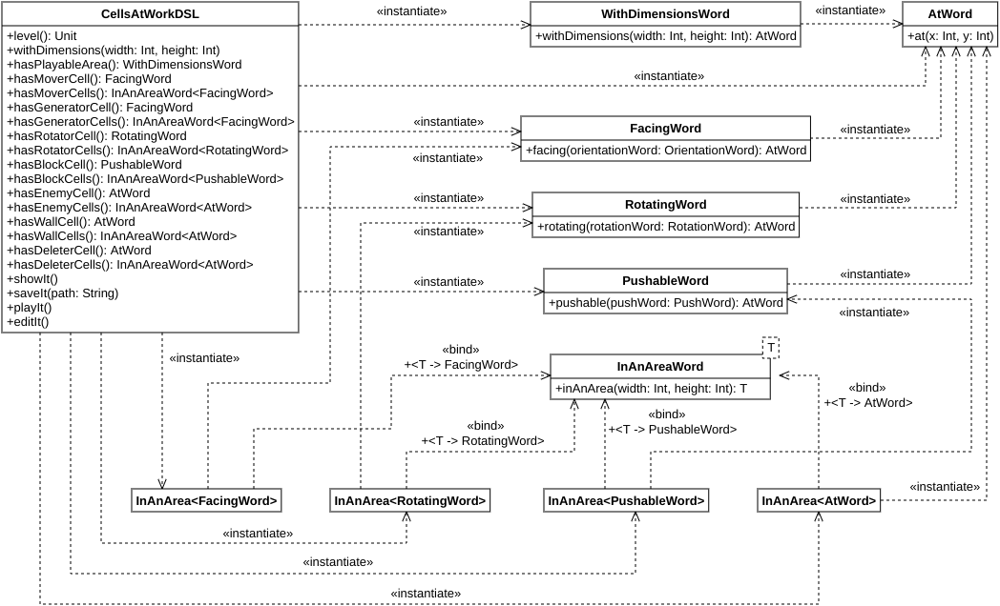

# Design

## Design architetturale

L'architettura dell'applicazione sviluppata si è basata su "Model-View-Controller", essendo questo il pattern architetturale di riferimento per le applicazioni dotate di interfaccia grafica. La sua pura e semplice attuazione, dividendo l'applicazione in tre componenti, però, non avrebbe potuto soddisfare i requisiti di modularità che ci erano stati richiesti. Per questo motivo si è deciso di dividere l'architettura ortogonalmente in quattro componenti principali. Il primo è quello più semplice, "Application", che rappresenta l'applicazione nel suo complesso. È costituito solamente dalle sotto-componenti "*controller*" e "*view*", che fanno da "genitori" per tutte le altre sotto-componenti analoghe degli altri tre componenti. Il sotto-componente "*model*" in questo caso è assente dato che si è voluto segregare completamente il modello dei dati di ciascun componente. Unica eccezione è il modello del dominio, che è comune a tutti, ed è per questo poco rilevante per quanto riguarda l'architettura dell'applicazione nel suo complesso.

Il legame di parentela tra sotto-componenti, per quanto riguarda il *controller* del componente "Application", si traduce nella necessità di tutti gli altri *controller* che hanno bisogno di servizi che non possono o non devono essere capaci di fornire da soli di fare riferimento per questi al loro genitore. In questo modo si osserva il principio di "*dependency inversion*", dove le effettive implementazioni dei *controller* dipenderanno dall'interfaccia fornita dal loro genitore e niente altro. Per quanto riguarda la *view*, invece, dato che i servizi di cui una *view* necessita sono sempre forniti dal suo *controller* associato, questa relazione di genitorialità si manifesta nella capacità di creare nuove *sub-view* di qualsiasi tipo a richiesta, permettendo il passaggio visuale da una componente all'altra dell'applicazione sotto controllo dell'utente. Questo significa che deve esporre dei metodi per mostrare il menu principale, per far mostrare l'interfaccia di gioco per giocare un solo livello o per giocare ad una sequenza di livelli partendo da uno di essi oppure mostrare l'interfaccia dell'editor per modificare un livello nuovo, vuoto, oppure uno già creato in precedenza. Ulteriore indipendenza tra i componenti è garantita dal fatto che, pur essendo dipendenti da un *controller* genitore che fornisce loro servizi, questi non dipendono dallo stesso tipo di *controller*, ma da un *controller* genitore che sia ritagliato sulle loro esclusive necessità, applicando il principio di "*interface segregation*". In questo modo, qualsiasi altro software voglia dotarsi dei componenti di seguito elencati, non necessita di doversi comporre anche del componente "Application", ma semplicemente gli basterà sostituirsi ad esso aderendo all'interfaccia che definisce i servizi che il componente di cui si vuole dotare ha bisogno.

Il secondo componente dell'applicazione è quello "Game", relativo al gioco vero e proprio che può essere giocato attraverso l'applicazione. È uno dei componenti più complessi e, in quanto tale, possiede sia un sotto-componente "*controller*", sia uno "*view*", sia uno "*model*". Il *model* del gioco, dovendo modellare il comportamento del gioco, la sua *business logic*, dovrà mantenere uno stato, che contiene tutte le informazioni sulle condizioni correnti del gioco e permette di decidere quali saranno i suoi futuri cambiamenti. Inoltre, così come da specifiche, deve essere possibile richiedere l'aggiornamento delle condizioni del gioco per poterne eseguire un "passo", indipendentemente che sia stato richiesto direttamente dall'utente o automaticamente dall'applicazione. Si deve poter passare al livello successivo, resettare lo stato del gioco corrente a come era prima di iniziare la seconda fase di ogni livello, ovvero quella dove l'utente non ha più facoltà di modificare lo stato del gioco corrente ma può solo osservarne l'evoluzione. Infine, il *model* permette di muovere le cellule dalla posizione in cui si trovano ad un'altra libera, così da permettere all'utente di effettuare la prima fase del gioco, quindi quella di sistemazione dello stato iniziale della griglia di gioco.

Il *controller* del componente "Game", dunque, dovrà esporre i servizi offerti dal *model* esattamente come le specifiche richiedono. Questo si traduce nel fatto che il *controller* permette, così come lo permette anche il *model*, di spostare le cellule nella griglia, così da permettere la prima fase del gioco, di riportare le condizioni del livello a quelle iniziali, ovvero prima di richiedere gli aggiornamenti che costituiscono la seconda fase del gioco, e di passare al livello successivo. Il *controller* però permette anche di richiedere l'aggiornamento delle condizioni del gioco di un solo "*step*", in modo tale che sia facoltà dell'utente di decidere se e quando aggiornare lo stato del gioco, ma anche di lasciare che gli aggiornamenti avvengano in maniera automatica dopo una prima richiesta dell'utente stesso. Inoltre, così come gli aggiornamenti automatici possono essere fatti partire, possono anche essere sospesi. Infine, il *controller* permette anche di uscire dal gioco, richiesta che necessariamente fatta pervenire verso il *controller* genitore, dato che è il componente di più alto livello a decidere quale nuova *view* sarà mostrata all'uscita del gioco. È importante sottolineare anche il fatto che, ogni volta che l'utente chiede di passare al prossimo livello, questo significa che ha completato quello corrente, perciò è bene annotare questo fatto in maniera che l'utente possa poi vedere dal menu principale quali livelli ha già giocato e completato e quali invece restano da completare. Essendo un operazione che richiede persistenza, è stato deciso di propagare l'operazione al sotto-componente genitore così da mantenere questo tipo di operazioni tutte concentrate in un unico punto.

La *view* del componente "Game" invece dovrà permettere di visualizzare sia gli effetti delle azioni del giocatore sul gioco stesso, sia gli aggiornamenti del mondo di gioco secondo l'applicazione delle regole del gioco stesso ad ogni "*step*". Per questo motivo dovrà essere possibile disegnare una griglia di gioco durante la prima fase, quella di "*setup*", che verrà richiesto ogniqualvolta occorra ridisegnare da zero una griglia di quel tipo, ovvero dopo una richiesta di "*reset*" da parte del giocatore. Inoltre, sempre per la stessa ragione, deve essere possibile disegnare una griglia di gioco durante la seconda fase, cosiddetta di "*play*", ad esempio ogni volta che avviene un aggiornamento delle condizioni di gioco. Assieme alla griglia è necessario indicare altre informazioni che si vogliono mostrare attraverso la *view*, cioè se il livello è stato completato o no, per permettere all'utente di avanzare a quello successivo, e se un nemico è stato ucciso, per renderlo partecipe che è ora necessario eliminare un nemico in meno per completare il livello. Ad ogni avanzamento di livello, così come quando viene avviato per la prima volta il gioco, è necessario disegnare il livello per intero e assieme al livello occorre notificare il fatto per cui il livello è stato già completato oppure no, in modo tale da non permettere all'utente di giocare un livello che di fatto non può essere giocato.

Il terzo componente è "Editor", quello relativo all'*editor* di livelli. Anche questo componente è a sua volta costituito da un sotto-componente "*model*", uno "*controller*" e uno "*view*". Il *model* deve trattenere lo stato corrente del processo di costruzione del livello, in modo tale da poter estrarre dalle informazioni ricevute il livello costruito, se possibile, così da poterlo fare persistere su richiesta dell'utente. Le operazioni che possono essere fatte all'interno dell'*editor* sono quelle di aggiungere o rimuovere una cellula in una data posizione, spostare una cellula da una posizione ad un'altra, aggiungere o rimuovere l'area di gioco dal livello e infine di fare un'operazione di "*reset*", svuotando il livello di tutto ciò che conteneva in precedenza. Ognuna delle operazioni è stata tradotta in un metodo dell'entità "model". Il componente "*controller*" espone tutte le precedenti operazioni del *model* in modo tale che la *view* possa permettere all'utente di eseguirle, più l'operazione per salvare un livello in un file dato il suo percorso e quella per chiudere l'*editor* e tornare indietro. Queste due operazioni vengono poi demandate al *controller* genitore di questo componente. Questo perché, per la prima operazione, sia sempre unico il *controller* che si occupa della persistenza delle risorse, mentre per la seconda per poter notificare la componente di *view* di più alto livello che è necessario cambiare ciò che l'utente sta correntemente vedendo. Il sotto-componente "*view*" dell'*editor* deve invece solamente ridisegnare ogni volta il livello ogniqualvolta si manifesta un cambiamento nello stato del *model* a seguito di un'azione dell'utente.

Ultimo componente, ma non per questo meno importante, è quello relativo al menu principale, "Main Menu". Anche in questo caso questo è stato suddiviso solamente in un sotto-componente "*controller*" e un sotto-componente "*view*", dato che il menu principale è essenzialmente una componente visuale dell'applicazione e perciò non presenta alcun tipo di modello dei dati a cui fare riferimento. Il *controller* mette a disposizione della *view* tutte le operazioni che possono essere eseguite dal menu principale sotto forma di metodi. In primis, offre la possibilità di far partire il gioco per giocare un livello deserializzato da un file oppure per giocare un livello che fa parte della sequenza dei livelli offerti di default dall'applicazione. In secundis, offre la possibilità di aprire l'*editor* per modificare un livello vuoto, di cui conosciamo le informazioni fondamentali per mostrarlo all'utente, ovvero le sue dimensioni, oppure un livello costruito in precedenza e deserializzato da *file*. Inoltre, permette di mostrare all'utente quali sono i livelli che finora è riuscito a risolvere, qual è il volume della musica e degli effetti sonori attuali e modificarli a suo piacimento. Infine, permette di tornare indietro alla schermata principale del menu, dato che questo può essere composto di più sotto-pagine, ognuna relativa ad uno specifico gruppo di informazioni e di uscire dall'applicazione. Tutti questi servizi vengono offerti demandandoli al *controller* genitore, dato che o coinvolgono necessariamente un cambio di *view* nell'interfaccia grafica o necessitano dell'uso di servizi di persistenza che rimangono confinati nel *controller* di livello superiore. Se le impostazioni sono considerate come un unico informazione esposta dal *controller* genitore, nella componente *controller* "Main Menu" invece vengono scomposte nei singoli elementi così che eventuali ulteriori sotto-componenti possano accedere ai singoli settaggi indipendentemente. La componente "*view*" del "Main Menu" invece non espone alcun servizio dato che il *controller* non ha mai informazioni che deve richiedere alla *view* di visualizzare.

{ width=100% }

Dalle specifiche precedentemente descritte sul DSL, si è deciso di costruire un linguaggio che le soddisfa con una grammatica libera dal contesto qui di seguito descritta. Per poter descrivere un nuovo livello, occorre aprire un nuovo blocco, il quale deve essere preceduto dalla parola "level". Ogni istruzione che definisce le caratteristiche del livello stesso deve essere posta su di una nuova riga, cioè deve essere separata dalla precedente tramite un carattere di "*newline*". Le istruzioni che possono essere specificate all'interno del blocco sono definite dalla seguente grammatica espressa in forma di Backus-Naur estesa

```{=latex}
\begin{table}[H]
	\centering
	\begin{tabular}{lclN}
		Statement & = & WithDimensionsWord & \label{prod:1} \\
		& | & ``hasPlayableArea '', WithDimensionsWord, AtWord & \label{prod:2} \\
		& | & ``hasMoverCell facing '', OrientationWord, AtWord & \label{prod:3} \\
		& | & ``hasMoverCells '', InAnAreaWord, `` facing '', OrientationWord, AtWord & \label{prod:4} \\
		& | & ``hasGeneratorCell facing '', Orientation, AtWord & \label{prod:5} \\
		& | & ``hasGeneratorCells '', InAnAreaWord, `` facing '', OrientationWord, AtWord & \label{prod:6} \\
		& | & ``hasRotatorCell rotating '', Rotation, AtWord & \label{prod:7} \\
		& | & ``hasRotatorCells '', InAnAreaWord, `` rotating '', RotationWord, AtWord & \label{prod:8} \\
		& | & ``hasBlockCell pushable '', Push, AtWord & \label{prod:9} \\
		& | & ``hasBlockCells '', InAnAreaWord, `` pushable '', PushWord, AtWord & \label{prod:10} \\
		& | & ``hasEnemyCell'', AtWord & \label{prod:11} \\
		& | & ``hasEnemyCells '', InAnAreaWord, AtWord & \label{prod:12} \\
		& | & ``hasWallCell'', AtWord & \label{prod:13} \\
		& | & ``hasWallCells '', InAnAreaWord, AtWord & \label{prod:14} \\
		& | & ``hasDeleterCell'', AtWord & \label{prod:15} \\
		& | & ``hasDeleterCells '', InAnAreaWord, AtWord & \label{prod:16} \\
		& | & ``printIt'' & \label{prod:17} \\
		& | & ``saveIt ('', String, ``)'' & \label{prod:18} \\
		& | & ``playIt'' & \label{prod:19} \\
		& | & ``editIt''; & \label{prod:20} \\
		\multicolumn{4}{l}{WithDimensionsWord = ``withDimensions ('', Int, ``, '', Int, ``)'';} \\
		\multicolumn{4}{l}{AtWord = `` at ('', Int, ``, '', Int, ``)'';} \\
		\multicolumn{4}{l}{InAnAreaWord = ``inAnArea ('', Int, ``, '', Int, ``)'';} \\
		\multicolumn{4}{l}{OrientationWord = ``right'' | ``left'' | ``top'' | ``bottom'';} \\
		\multicolumn{4}{l}{RotationWord = ``clockwise'' | ``counterclockwise'';} \\
		\multicolumn{4}{l}{PushWord = ``vertically'' | ``horizontally'' | ``inBothDirections'';} \\
	\end{tabular}
\end{table}

\noindent dove

\begin{itemize}
	\item la \eqref{prod:1} permette di specificare le dimensioni del livello
	\item la \eqref{prod:2} permette di specificare le dimensioni e la posizione, intesa come coordinate dell'angolo in altro a sinistra, dell'area di gioco
	\item la \eqref{prod:3} permette di specificare la presenza di una cellula "mover", orientata in una certa direzione, alla posizione data
	\item la \eqref{prod:4} permette di specificare la presenza di un gruppo di cellule "mover", orientate in una certa direzione, che riempiono un'area le cui dimensioni e la cui posizione, intesa come coordinate dell'angolo in alto a sinistra, sono date 
	\item la \eqref{prod:5} permette di specificare la presenza di una cellula "generator", orientata in una certa direzione, alla posizione data
	\item la \eqref{prod:6} permette di specificare la presenza di un gruppo di cellule "generator", orientate in una certa direzione, in un area le cui dimensioni e la cui posizione, intesa come coordinate dell'angolo in alto a sinistra, sono date
	\item la \eqref{prod:7} permette di specificare la presenza di una cellula "rotator", che ruota in una certa direzione di rotazione, alla posizione data
	\item la \eqref{prod:8} permette di specificare la presenza di un gruppo di cellule "rotator", che ruotano in una certa direzione di rotazione, in un area le cui dimensioni e la cui posizione, intesa come coordinate dell'angolo in alto a sinistra, sono date
	\item la \eqref{prod:9} permette di specificare la presenza di una cellula "block", che può essere spinta in una certa direzione, alla posizione data
	\item la \eqref{prod:10} permette di specificare la presenza di un gruppo di cellule "block", che possono essere spinte in una certa direzione, in un area le cui dimensioni e la cui posizione, intesa come coordinate dell'angolo in alto a sinistra, sono date
	\item la \eqref{prod:11} permette di specificare la presenza di una cellula "enemy" alla posizione data
	\item la \eqref{prod:12} permette di specificare la presenza di un gruppo di cellule "enemy" in un area le cui dimensioni e la cui posizione, intesa come coordinate dell'angolo in alto a sinistra, sono date
	\item la \eqref{prod:13} permette di specificare la presenza di una cellula "wall" alla posizione data
	\item la \eqref{prod:14} permette di specificare la presenza di un gruppo di cellule "wall" in un area le cui dimensioni e la cui posizione, intesa come coordinate dell'angolo in alto a sinistra, sono date
	\item la \eqref{prod:15} permette di specificare la presenza di una cellula "deleter" alla posizione data
	\item la \eqref{prod:16} permette di specificare la presenza di un gruppo di cellule "deleter" in un area le cui dimensioni e la cui posizione, intesa come coordinate dell'angolo in alto a sinistra, sono date
	\item la \eqref{prod:17} permette di visualizzare a riga di comando il livello creato
	\item la \eqref{prod:18} permette di salvare il livello creato in un file il cui percorso è dato
	\item la \eqref{prod:19} permette di giocare il livello appena creato
	\item la \eqref{prod:20} permette di aprire il livello appena creato nel \textit{editor} di livelli
\end{itemize}
```

{ width=100% }

## Design di dettaglio

Le entità nate dalla modellazione del dominio in fase di analisi sono state facilmente tradotte in classi di design senza apportare nessuna modifica degna di nota. Le uniche entità per cui invece questa cosa non è vera e la cui discussione si rivela interessante sono "Cell" e tutti le classi che la estendono. Ci si è resi conto che, nell'applicazione, la soluzione migliore per rappresentare le "Cell" in una ``Board" era quella di aggregarle tutte assieme al suo interno, senza distinguere in base al tipo delle stesse. Questo, da un punto di vista puramente concettuale, meglio reifica il modello stesso che è stato pensato, che asseconda l'intuizione, mentre, da un punto di vista più concreto, permette di diminuire gli errori nella gestione delle cellule nella griglia, dato che non è possibile "dimenticarsene" qualcuna. Inoltre, questo aumenta l'estendibilità del codice dato che, ad esempio nel caso dell'aggiunta di un nuovo tipo di cellule, "Board" non deve essere toccata per nessun motivo, come è giusto che sia.

La problematica che questo tipo di approccio fa sorgere si ha nel momento nel quale si vogliono costruire più gerarchie di ereditarietà, cosa che si è poi resa necessaria. Per capire se una determinata cellula può essere spostata dall'utente oppure no - ad esempio perché si trova sull'area di gioco durante questo stesso, ma non necessariamente, si pensi ad esempio al funzionamento dell'*editor* - è utile dotarla di un attributo ulteriore, "playable", che fornisca proprio questa informazione. Questa nuova entità, detta "PlayableCell", con una sua gerarchia analoga a quella di "Cell", estenderà da quest'ultima. Questo però significa che, se dicessimo semplicemente che una "Board" è un insieme di "Cell", allora vuol dire che potrebbe sia contenere cellule che discendono direttamente da "Cell", sia cellule che discendono da "PlayableCell", violando chiaramente il modello del dominio che era stato creato.

Per non impedire la presenza di ulteriori entità che discendono da "Cell" e allo stesso tempo per garantire la *type safeness* di questo approccio, si è deciso di creare un'ulteriore gerarchia, analoga alla precedente, che però discende da "BaseCell", che a sua volta discende da "Cell", e non aggiunge nulla a rispetto a quest'ultima. La conseguenza è che la "Board" ora può contenere o cellule standard, equivalenti a quelle definite nel modello del dominio, oppure delle "PlayableCell", ma mai entrambe assieme. Questo ha per conseguenza necessariamente il dover rendere generico "Board", per non sdoppiare inutilmente l'implementazione di questa classe, per fare in modo che accettasse un qualsiasi sottotipo di "Cell". Analogamente, si è deciso di rendere generica allo stesso modo anche la classe "Level". Lo svantaggio di questa scelta è che, benché "BaseCell" e "PlayableCell" hanno molto in comune, dacché discendono da "Cell", i loro tipi devono essere invarianti l'uno rispetto all'altro, pena ricadere nel problema di prima. Questo significa che devono essere definiti degli opportuni "*converter*" che permettano di passare da una classe ad una sua analoga nell'altra gerarchia. Errori in questo tipo di metodi però è stato giudicato più facilmente visibile rispetto a quelli citati precedentemente.

Nella realizzazione del *Domain Specific Language* per la costruzione dei livelli si è dovuto affrontare un problema simile, dato che occorre tenere traccia delle cellule che ha inserito nella griglia del livello. In questo caso però la soluzione è stata diametralmente opposta. Infatti, si è deciso di avere un insieme di cellule diverse per ogni tipo e non un insieme unico per tutte le cellule, come succedeva per "Board". Questo perché, se non fosse stato così, non si sarebbero potuti catturare alcuni errori nella costruzione del livello come la sovrapposizione di due cellule di tipi differenti. Questo infatti non deve essere possibile, ma se tutte le cellule sono state inserite nello stesso *set*, allora si è costretti o ad ignorare l'errore, decidendo di eliminare dall'insieme la cellula già inserita oppure quella da inserire se ne è già presente una all'interno dell'insieme, o a gestirlo nel momento in cui si verifica, cioè all'atto dell'inserimento. Questo però contravveniva all'idea di voler effettuare i controlli di correttezza esclusivamente alla fine, quando poi l'utente vuole visualizzare o salvare il livello. Questo approccio "*lazy*" permette infatti di scindere la logica di validazione dagli altri compiti di raccolta delle informazioni fornite dall'utente. *In summa*, ci si è resi conto che l'approccio di avere più *set* risultava in questo caso il più conveniente, pur essendo soggetto agli errori elencati sopra. Un'ulteriore alternativa sarebbe stata quella di avere delle liste anzichè degli insiemi di cellule, cosa che però risultava poco adatta, dovendo rinunciare al vincolo di unicità che i *set* garantiscono, impedendo la ripetizione di più cellule identiche nel livello.

{ width = 100% }

Il design dello stato del gioco, rappresentato dalla classe "GameState", è stato fatto considerando quali sono le informazioni utili che questo deve trattenere affinché il gioco possa svolgersi correttamente. In primo luogo, lo stato del gioco dovrà trattenere lo stato corrente del livello che il giocatore sta giocando, in modo da poter richiamare il metodo di aggiornamento della simulazione con quest'ultimo ed ottenere il prossimo stato che il livello assume, facendo avanzare la simulazione di uno "*step*". Per supportare la possibilità di riportare lo stato del livello a quello immediatamente precedente all'inizio della fase di "play", ovvero il "*reset*" del livello, è necessario trattenere anche lo stato iniziale del livello. Quando il giocatore ad ogni partita vede per la prima volta un livello, lo stato iniziale e corrente del livello sono allineati e lo rimangono finché il giocatore non decide di passare dalla fase di "setup" a quella di "play". Solamente in questo modo è possibile effettuare il "*reset*" come è stato descritto poco fa.

Altre informazioni di fondamentale importanza sono quelle legate all'indice del livello corrente e alla *flag* che indica se è disponibile un prossimo livello oppure no. Come è noto, una partita può essere iniziata o per giocare ad un livello singolo, creato dal giocatore, oppure per giocare una sequenza di livelli, che sono quelli forniti di default dal gioco. In entrambe le situazioni ci si trova nelle condizioni in cui non c'è più un livello successivo a cui arrivare, perciò occorre "tornare indietro", cioè al menu se si viene dal menu oppure chiudere l'applicazione se è stata lanciata esclusivamente la componente "Game" di tutta l'applicazione. Questo significa che si deve poter controllare se c'è un prossimo livello prima di chiedere al *model* di passare al prossimo livello. Si è comunque deciso di non fare nulla nel caso il metodo per avanzare al livello successivo sia richiamato quando un livello successivo non c'è oppure quando non è possibile farlo perché il livello non è completo. Generare un'eccezione o notificare un errore attraverso la *view* sono soluzioni alternative che avrebbero reso il design innecessariamente convoluto e il risultato finale non avrebbe portato nessuna informazione utile all'utente. L'utilizzo di un indice per il livello corrente mostra la sua utilità nel momento nel quale è necessario serializzare i livelli che il giocatore ha completato per poter mostrare il suo progresso nel gioco.

Quanto detto finora lascia presupporre l'esistenza di un *flag* ulteriore nello stato del gioco che permetta di capire se il livello è stato completato dopo l'ultimo step compiuto oppure no. In realtà non necessita di essere reso disponibile all'esterno, se non per il fatto che, tra gli eventi di gioco che si vogliono notificare al giocatore, c'è proprio quello per cui il livello è stato completato e può perciò proseguire al prossimo. Per la stessa ragione, ovvero per notificare l'evento al giocatore, è stato inserito anche un *flag* che permette di segnalare se nell'ultimo passo di simulazione del gioco un nemico è stato ucciso oppure no, portando il giocatore un po' più vicino alla vittoria del livello.

Per quanto riguarda invece lo stato del componente "model" dell'*editor*, lo stato ha un design molto più semplice rispetto alla sua controparte del gioco. Esso infatti assomiglia a come è stato definito "Level", dato che l'*editor* di livelli non fa altro che permettere di creare o modificare un livello. Le informazioni che deve trattenere non sono altro che quelle sul livello che sta venendo manipolato. Unica eccezione riguarda l'area di gioco che l'utente potrebbe non avere impostato e perciò non è detto che sia presente nello stato. Da qui la necessità di renderla opzionale. Ricordiamo inoltre che le dimensioni non sono opzionali perché un livello, anche se viene creato vuoto, deve almeno definire le sue dimensioni. La "Board" del livello non è anch'essa opzionale perché è lecito che sia lasciata vuota.

Un altro aspetto degno di nota riguarda la gestione degli *step* della simulazione gioco. Visto che le regole dovevano essere implementate nel linguaggio PROLOG, era necessario che l'interprete si interfacciasse con il resto dell'applicazione realizzata nel linguaggio scala. L'idea è stata perciò di applicare il pattern "*façade*", così da esporre solamente il servizio di interesse dell'interprete PROLOG, ovvero la possibilità di risolvere un *goal* e ottenere il corrispondente risultato. È nata così la classe "PrologEngine", dotata del metodo "solve" che riceve un "Goal" e produce un "Result". La *façade* però non interagisce direttamente con il *model* del gioco, ma viene utilizzata da un ulteriore classe, che è "RulesEngine". Questa classe nasce per isolare in un'unica entità la gestione degli aggiornamenti dello stato corrente della "Board" così da ottenere lo stato successivo e poterlo quindi mostrare all'utente. In questo modo, è stato possibile applicare "*separation of concerns*" sul "GameModel", dividendo la modifica del suo stato interno dai calcoli necessari per passare dallo stato corrente a quello successivo. Inoltre, "RulesEngine" non viene creata direttamente dal "GameModel", ma le viene passata, secondo il pattern "*dependency injection*". In questo modo, questo *model* dipende ancor più strettamente dall'interfaccia che "RulesEngine" fornisce e non dalla sua implementazione, seguendo il principio di "*dependency inversion*".

```{=latex}
\begin{figure}[H]
	\centering
	\begin{subfigure}[H]
		\centering
  		\includegraphics[width=0.5\linewidth]{imgs/game_model_design.png}
		\caption{Diagramma delle classi che illustra il design dello stato del \textit{model} di gioco}
	\end{subfigure}
	\begin{subfigure}[H]
		\centering
  		\includegraphics[width=0.5\linewidth]{imgs/editor_model_design.png}
		\caption{Diagramma delle classi che illustra il design dello stato del \textit{model} dell'\textit{editor}}
	\end{subfigure}
\end{figure}
```

Il comportamento del metodo "update" di "RulesEngine" ha dovuto essere sviscerato nel dettaglio per far sì che potesse essere correttamente realizzato. Prima di poter effettuare lo "*step*" vero e proprio, è stato prima necessario convertire la "Board" di cellule in input affinché diventasse una griglia di "UpdatableCell", cioè cellule che possiedono degli ulteriori attributi per permetterne il corretto aggiornamento. Nella fattispecie, vengono dotate di un identificatore univoco, che permetta di distinguerle tra di loro, e da un *flag* che dica se la cellula ha già ricevuto aggiornamento oppure no. Questo perché, di norma, l'identità di una cellula è garantita dalla sua posizione all'interno della griglia, dato che solamente una cellula alla volta può essere presente all'interno di una cella. Quando però le posizioni cambiano durante l'aggiornamento, occorre affidarsi su qualcosa di differente per poter identificare univocamente una "Cell" e stabilire delle corrispondenze tra prima e dopo l'aggiornamento. Il fatto che poi le cellule vadano serializzate per essere passate all'interprete PROLOG complica ulteriormente il problema, dato che l'identità deve rimanere univoca anche dopo che il calcolo effettuato da PROLOG è stato completato e devono essere create delle nuove istanze con però l'identità precedente. La soluzione più semplice, ma allo stesso tempo più efficace, che garantisce il successo senza particolari questioni collaterali è stato appunto quella di aggiungere un identificatore univoco alle cellule.

L'utilizzo del *flag* per segnalare se una cellula ha già ricevuto un aggiornamento o meno è legato al modo in cui gli aggiornamenti devono essere effettuati nel gioco. Avendo ogni tipologia di cellula il suo comportamento, diverso dagli altri, e che perciò influenza diversamente l'intorno delle cellule considerato, l'aggiornamento della simulazione non può essere fatto simultaneamente per ciascuna cellula. Occorre decidere un ordine in cui considerare le cellule e, per ognuna, calcolare le modifiche che essa compie sulla griglia per poi applicarle e usare la griglia aggiornata come base per l'aggiornamento della cellula successiva e così via. Se non avessimo il *flag* in "UpdateCell", perciò, potrebbe accadere che una cellula già aggiornata potrebbe essere incontrata nuovamente nella ricerca di quelle rimanenti da aggiornare e perciò provocare 

Benchè questo possa portare a dei comportamenti inattesi per il giocatore, un attento studio del gioco originale ci ha permesso di estrapolare la sequenza in cui le cellule vengono considerate per l'aggiornamento. Le uniche cellule che richiedono un aggiornamento esplicito, perché agiscono sul loro ambiente circostante, sono "GeneratorCell", "RotatorCell" e "MoverCell". L'ordine di importanza in cui vengono considerate è quello riportato, questo significa che prima vengono aggiornate quelle del tipo più importante, poi quelle del tipo immediatamente successivo e così via. Tra quelle dello stesso tipo, l'ordine in cui le cellule vengono considerate è quello da sinistra verso destra e dall'alto verso il basso, così come ci aspetteremmo di scorrere la griglia.

Questo significa che il metodo update esegue tre volte la stessa operazione, una per tipo di cellula da aggiornare: prima di tutto cerca la prossima cellula di quel tipo che può essere aggiornata, perciò scorre la griglia dall'alto verso il basso, da sinistra verso destra, alla ricerca della prima cellula ha il *flag* "updated" a falso. Se non ce ne sono, ripete la procedura per un tipo di cellula di importanza inferiore oppure termina riconvertendo la "*updatable board*" in una "Board" semplice che ha completato di aggiornare. Se invece ne trova un'altra, estrae l'intorno di quella cellula, cioè le cellule che potranno essere potenzialmente interessate dal suo aggiornamento. Per la "GeneratorCell" è la cellula che si trova dietro di essa, che può essere appunto generata, più tutte le cellule che si trovano di fronte ad essa, che possono essere spostate. Per la "RotatorCell" sono le cellule ad essa adiacenti, ovvero poste ai quattro lati della stessa. Infine, per la "MoverCell", sono tutte le cellule che si trovano davanti ad essa, perchè sono quelle che possono essere da essa spostate. Una volta estratto l'intorno della cellula da aggiornare, questo viene passato assieme alla cellula al motore PROLOG per aggiornarli e poi, con il risultato, viene costruita una "Board" aggiornata e il ciclo ricomincia.

{ width = 100% }


{ width = 100% }


{ width = 100% }


{ width = 100% }

{ width = 100% }
