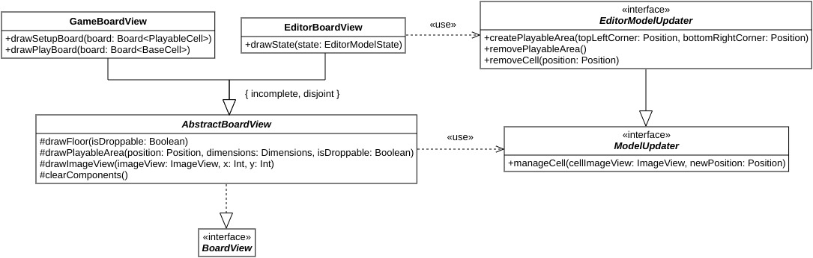

# Design

## Design architetturale

L'architettura dell'applicazione sviluppata si è basata sul pattern "Model-View-Controller", essendo questo il pattern di riferimento per le applicazioni dotate di interfaccia grafica. La sua pura e semplice attuazione, che avrebbe diviso l'applicazione in tre componenti, non avrebbe però potuto soddisfare i requisiti di modularità che erano stati richiesti. Per questo motivo si è deciso di dividere l'architettura ortogonalmente in quattro componenti principali. Il primo è quello più semplice, "Application", che rappresenta l'applicazione nel suo complesso. È costituito solamente dalle sotto-componenti "*controller*" e "*view*", che fanno da "genitori" per tutte le altre sotto-componenti analoghe degli altri tre componenti. Il sotto-componente "*model*" è in questo caso assente visto che non ci sono dati che necessitano una modellazione tale da giustificare la presenza di un'entità *model*.

### Componente "Application"

Il legame di parentela tra sotto-componenti, per quanto riguarda il *controller* del componente "Application", si traduce nella necessità di tutti gli altri *controller*, che hanno bisogno di servizi che non possono o non devono essere capaci di fornire da soli, di fare riferimento per questi al loro genitore. In questo modo si garantisce l'aderenza al principio di "*dependency inversion*", dove le effettive implementazioni dei *controller* dipenderanno dall'interfaccia fornita dal loro genitore. Per quanto riguarda la *view* di "Application", invece, dato che i servizi di cui una qualsiasi *view* necessita sono sempre forniti dal *controller* associato, questa relazione di parentela si traduce nella capacità di creare nuove *sub-view* a richiesta. Questo permette di passare da una componente all'altra dell'applicazione in maniera visiva quando l'utente ne fa richiesta. Questo significa che il componente "*view*" deve esporre dei metodi per mostrare il menu principale, per mostrare l'interfaccia di gioco per giocare ad un solo livello o per giocare ad una sequenza di livelli partendo da uno di essi oppure per mostrare l'interfaccia dell'editor per modificare un livello nuovo, vuoto, oppure uno già creato in precedenza.

Ulteriore indipendenza tra i componenti è garantita dal fatto che, pur essendo dipendenti da un *controller* genitore che fornisce loro i servizi di cui necessitano, questi non dipendono dallo stesso tipo di *controller*, ma ognuno dipende da un *controller* che è ritagliato sulle sue esclusive necessità, applicando il principio di "*interface segregation*". In questo modo, qualsiasi altro software che voglia dotarsi di uno o più componenti di questa applicazione non necessita di doversi comporre anche del componente "Application". Semplicemente gli basterà sostituirsi ad esso aderendo all'interfaccia che definisce i servizi che il o i componenti di cui si vuole dotare hanno bisogno. Questo significa anche che il *controller* di "Application" aderisce a tutte queste interfacce.

### Componente "Game"

Il secondo componente presente nell'applicazione è quello "Game", relativo al gioco vero e proprio. È uno dei componenti più complessi e, in quanto tale, possiede sia un sotto-componente "*controller*", sia uno "*view*", sia uno "*model*". Il *model*, dovendo modellare il comportamento del gioco, dovrà mantenere uno stato capace di contenere tutte le informazioni sulle condizioni correnti del gioco stesso. Inoltre, così come da specifiche, deve essere possibile richiedere al *model* l'aggiornamento dello stato del gioco per poter eseguire un "passo" di evoluzione, indipendentemente che sia stato richiesto direttamente dall'utente o automaticamente dall'applicazione. Il *model* deve poter permettere di passare al livello successivo e di resettare lo stato corrente del gioco a come era prima di iniziare la fase di "play" in ogni livello. Infine, il *model* deve permettere di muovere le cellule dalla posizione in cui si trovano ad un'altra libera, così da rendere possibile la fase di "setup" del gioco. Per seguire il principio di "*favor immutability*", ciascuno dei servizi offerti dal *model* non è capace di modificarne lo stato, ma invece fa in modo di produrne un nuovo dove l'operazione è avvenuta, se possibile.

Il *controller* del componente "Game" dovrà innanzitutto esporre i servizi offerti dal *model*. Questo si traduce nel fatto che il *controller* deve permettere di spostare le cellule nella griglia, deve permettere di riportare le condizioni del livello a quelle iniziali e deve permettere di passare al livello successivo. Il *controller*, però, deve permettere anche, in maniera separata, di richiedere che lo stato della simulazione sia aggiornato di un solo "*step*" e di richiedere che questi aggiornamenti avvengano in maniera automatica. Inoltre, così come questi aggiornamenti automatici possono essere fatti partire, deve poter essere possibile anche richiedere che siano sospesi. Infine, il *controller* deve poter permettere di uscire dal gioco, servizio che necessariamente deve essere demandato al *controller* genitore, dato che è il componente di più alto livello quello che decide quale nuova *view* sarà mostrata all'uscita del gioco. È importante sottolineare anche il fatto che, ogni volta che l'utente chiede di passare al prossimo livello, costui ha completato quello corrente. È bene annotare questo fatto in maniera tale che il giocatore possa poi vedere dal menu principale quali livelli ha già completato e quali invece restano da completare. Essendo questa un'operazione che richiede persistenza, è stato deciso di propagarla verso il sotto-componente genitore, così da mantenere questo tipo di servizi tutti concentrati in un unico punto dell'architettura.

La *view* del componente "Game" dovrà permettere di visualizzare sia gli effetti delle azioni del giocatore sul gioco, sia gli aggiornamenti dello stato del livello corrente derivanti da uno "*step*". Per questo motivo dovrà essere possibile disegnare una griglia di gioco durante la fase di "*setup*", servizio che verrà richiesto ogniqualvolta occorra ridisegnarne una da zero durante quella fase, ovvero alla richiesta di "*reset*" da parte del giocatore. Inoltre, sempre per la stessa ragione, deve essere possibile disegnare una griglia di gioco durante la fase di "*play*", il che si rende necessario ogni volta che avviene un aggiornamento dello stato della simulazione. In quest'ultimo caso, assieme alla griglia da disegnare, è necessario indicare le altre informazioni che si vogliono mostrare attraverso la *view*: se il livello è stato completato o no, per permettere all'utente di avanzare a quello successivo, e se un nemico è stato ucciso o no, per renderlo partecipe del fatto che ora è necessario eliminare un nemico in meno per completare il livello. Ad ogni avanzamento di livello, così come quando viene avviato per la prima volta il gioco, è necessario disegnare il livello corrente per intero e, assieme a questo, occorre notificare al giocatore se esso è di per sé completato oppure no, in modo tale da non permettere all'utente di giocare un livello che di fatto non può essere giocato. Per questo motivo la *view* deve offrire la possibilità di disegnare un livello da zero.

### Componente "Editor"

Il terzo componente è "Editor", quello relativo all'*editor* di livelli. Anche questo componente è a sua volta costituito da un sotto-componente "*model*", uno "*controller*" e uno "*view*". Il *model* deve trattenere lo stato corrente del processo di costruzione del livello, in modo tale da poter estrarre dalle informazioni ricevute il livello costruito, se possibile. L'utente avrà così la possibilità di fare persistere il livello da lui creato. Le operazioni che possono essere fatte all'interno dell'*editor* sono quelle di aggiungere o rimuovere una cellula in una data posizione, spostare una cellula da una posizione ad un'altra, aggiungere o rimuovere l'area di gioco e infine fare un'operazione di "*reset*", svuotando il livello di tutto ciò che conteneva in precedenza. Ognuna di queste operazioni è di fatto un servizio offerto dall'entità "*model*". Anche in questo caso nessun servizio è capace di alterare lo stato del *model*, ma anzi ogni servizio ne restituisce uno nuovo dove l'operazione è stata eseguita, se possibile. Il componente "*controller*" espone tutte le operazioni del *model* precedentemente elencate, in modo tale che la *view* possa permettere all'utente di eseguirle, più il servizio per salvare un livello in un file dato il suo percorso e il servizio per chiudere l'*editor* e tornare indietro. Queste due operazioni vengono demandate al *controller* genitore del sotto-componente. Questo, per la prima operazione, perché sia sempre unico il *controller* che si occupa della persistenza delle risorse, mentre per la seconda, perché sia possibile notificare la componente di più alto livello che è necessario cambiare la *view* che l'utente sta correntemente vedendo. Il sotto-componente "*view*" dell'*editor* è tenuto solamente a ridisegnare il livello ogniqualvolta si manifesta un cambiamento nello stato del *model* a seguito di un'azione dell'utente.

### Componente "Main Menu"

L'ultimo componente è quello relativo al menu ed è chiamato "Main Menu". Come per "Application", questo componente è stato suddiviso solamente in un sotto-componente "*controller*" e un sotto-componente "*view*", dato che il menu è essenzialmente una componente visiva dell'applicazione e perciò non presenta alcun tipo di modello dei dati a cui fare riferimento. Il *controller* mette a disposizione della *view* tutte le operazioni che possono essere eseguite dal menu. In primis, offre la possibilità di far partire il gioco per giocare ad un livello de-serializzato da file oppure per giocare ad un livello che fa parte della sequenza dei livelli offerti di default dall'applicazione. In secondo luogo, offre la possibilità di aprire l'*editor* per modificare un livello vuoto, di cui conosciamo solamente le informazioni fondamentali per mostrarlo all'utente, ovvero le sue dimensioni, oppure un livello costruito in precedenza e de-serializzato da file. Inoltre, il *controller* permette di mostrare all'utente quali sono i livelli che finora è riuscito a risolvere, qual è il volume della musica e il volume degli effetti sonori attuali e permette di modificarli a suo piacimento. Infine, permette di tornare indietro alla schermata principale del menu, dato che questo può essere composto di più sotto-pagine, ognuna relativa ad uno specifico gruppo di informazioni, e permette di uscire dall'applicazione. Tutti questi servizi vengono offerti demandandoli al *controller* genitore, dato che o coinvolgono necessariamente un cambio di *view* nell'interfaccia grafica o necessitano dell'uso di servizi di persistenza che devono rimanere confinati nel *controller* di livello superiore. Se le impostazioni sono considerate come un'unica informazione esposta dal *controller* genitore, nella componente *controller* "Main Menu" invece vengono scomposte nei singoli elementi così che eventuali ulteriori sotto-componenti possano accedere alle singole informazioni indipendentemente. La componente "*view*" del "Main Menu" invece non espone alcun servizio dato che il *controller* non ha mai informazioni che deve richiedere alla *view* di visualizzare.

{ width=100% }

### DSL

Per soddisfare le specifiche sul *Domain Specific Language*, si è deciso di costruire un linguaggio con le seguenti caratteristiche. Per poter descrivere un nuovo livello, occorre aprire un nuovo blocco, il quale deve essere preceduto dalla parola "level". Ogni frase che definisce le caratteristiche del livello deve essere posta su di una nuova riga, cioè deve essere separata dalla precedente tramite un carattere di "*newline*". Le frasi che possono essere specificate all'interno del blocco sono definite dalla seguente grammatica libera dal contesto espressa in forma di Backus-Naur estesa

```{=latex}
\begin{table}[H]
	\centering
	\begin{tabular}{lclN}
		Statement & = & WithDimensionsWord & \label{prod:1} \\
		& | & ``hasPlayableArea '', WithDimensionsWord, AtWord & \label{prod:2} \\
		& | & ``hasMoverCell facing '', OrientationWord, AtWord & \label{prod:3} \\
		& | & ``hasMoverCells '', InAnAreaWord, `` facing '', OrientationWord, AtWord & \label{prod:4} \\
		& | & ``hasGeneratorCell facing '', Orientation, AtWord & \label{prod:5} \\
		& | & ``hasGeneratorCells '', InAnAreaWord, `` facing '', OrientationWord, AtWord & \label{prod:6} \\
		& | & ``hasRotatorCell rotating '', Rotation, AtWord & \label{prod:7} \\
		& | & ``hasRotatorCells '', InAnAreaWord, `` rotating '', RotationWord, AtWord & \label{prod:8} \\
		& | & ``hasBlockCell pushable '', Push, AtWord & \label{prod:9} \\
		& | & ``hasBlockCells '', InAnAreaWord, `` pushable '', PushWord, AtWord & \label{prod:10} \\
		& | & ``hasEnemyCell'', AtWord & \label{prod:11} \\
		& | & ``hasEnemyCells '', InAnAreaWord, AtWord & \label{prod:12} \\
		& | & ``hasWallCell'', AtWord & \label{prod:13} \\
		& | & ``hasWallCells '', InAnAreaWord, AtWord & \label{prod:14} \\
		& | & ``hasDeleterCell'', AtWord & \label{prod:15} \\
		& | & ``hasDeleterCells '', InAnAreaWord, AtWord & \label{prod:16} \\
		& | & ``printIt'' & \label{prod:17} \\
		& | & ``saveIt '', String & \label{prod:18} \\
		& | & ``playIt'' & \label{prod:19} \\
		& | & ``editIt''; & \label{prod:20} \\
		\multicolumn{4}{l}{WithDimensionsWord = ``withDimensions ('', Int, ``, '', Int, ``)'';} \\
		\multicolumn{4}{l}{AtWord = `` at ('', Int, ``, '', Int, ``)'';} \\
		\multicolumn{4}{l}{InAnAreaWord = ``inAnArea ('', Int, ``, '', Int, ``)'';} \\
		\multicolumn{4}{l}{OrientationWord = ``right'' | ``left'' | ``top'' | ``bottom'';} \\
		\multicolumn{4}{l}{RotationWord = ``clockwise'' | ``counterclockwise'';} \\
		\multicolumn{4}{l}{PushWord = ``vertically'' | ``horizontally'' | ``inBothDirections'';} \\
	\end{tabular}
\end{table}

\noindent dove

\begin{itemize}
	\item la \eqref{prod:1} permette di specificare le dimensioni del livello
	\item la \eqref{prod:2} permette di specificare le dimensioni e la posizione, intesa come coordinate dell'angolo in altro a sinistra, dell'area di gioco
	\item la \eqref{prod:3} permette di specificare la presenza di una cellula "mover", orientata in una certa direzione, alla posizione data
	\item la \eqref{prod:4} permette di specificare la presenza di un gruppo di cellule "mover", orientate in una certa direzione, che riempiono un'area le cui dimensioni e la cui posizione, intesa come coordinate dell'angolo in alto a sinistra, sono date 
	\item la \eqref{prod:5} permette di specificare la presenza di una cellula "generator", orientata in una certa direzione, alla posizione data
	\item la \eqref{prod:6} permette di specificare la presenza di un gruppo di cellule "generator", orientate in una certa direzione, in un area le cui dimensioni e la cui posizione, intesa come coordinate dell'angolo in alto a sinistra, sono date
	\item la \eqref{prod:7} permette di specificare la presenza di una cellula "rotator", che ruota in una certa direzione di rotazione, alla posizione data
	\item la \eqref{prod:8} permette di specificare la presenza di un gruppo di cellule "rotator", che ruotano in una certa direzione di rotazione, in un area le cui dimensioni e la cui posizione, intesa come coordinate dell'angolo in alto a sinistra, sono date
	\item la \eqref{prod:9} permette di specificare la presenza di una cellula "block", che può essere spinta in una certa direzione, alla posizione data
	\item la \eqref{prod:10} permette di specificare la presenza di un gruppo di cellule "block", che possono essere spinte in una certa direzione, in un area le cui dimensioni e la cui posizione, intesa come coordinate dell'angolo in alto a sinistra, sono date
	\item la \eqref{prod:11} permette di specificare la presenza di una cellula "enemy" alla posizione data
	\item la \eqref{prod:12} permette di specificare la presenza di un gruppo di cellule "enemy" in un area le cui dimensioni e la cui posizione, intesa come coordinate dell'angolo in alto a sinistra, sono date
	\item la \eqref{prod:13} permette di specificare la presenza di una cellula "wall" alla posizione data
	\item la \eqref{prod:14} permette di specificare la presenza di un gruppo di cellule "wall" in un area le cui dimensioni e la cui posizione, intesa come coordinate dell'angolo in alto a sinistra, sono date
	\item la \eqref{prod:15} permette di specificare la presenza di una cellula "deleter" alla posizione data
	\item la \eqref{prod:16} permette di specificare la presenza di un gruppo di cellule "deleter" in un area le cui dimensioni e la cui posizione, intesa come coordinate dell'angolo in alto a sinistra, sono date
	\item la \eqref{prod:17} permette di visualizzare a riga di comando il livello creato
	\item la \eqref{prod:18} permette di salvare il livello creato in un file il cui percorso è dato
	\item la \eqref{prod:19} permette di giocare il livello appena creato
	\item la \eqref{prod:20} permette di aprire il livello appena creato nel \textit{editor} di livelli
\end{itemize}
```

Le variabili "Int" e "String" presenti nella grammatica rappresentano rispettivamente un qualsiasi numero intero e una qualsiasi stringa. Le loro produzioni non sono state rappresentate nella grammatica perché considerate superflue.

{ width=100% }

## Design di dettaglio

### Modello del dominio dell'applicazione

Le entità nate dalla modellazione del dominio in fase di analisi sono state facilmente tradotte in classi di design senza apportare nessuna modifica degna di nota. Le uniche entità per cui invece questa cosa non è vera e la cui discussione si rivela interessante sono "Cell" e tutte le classi che la estendono. Ci si è resi conto che, nell'applicazione, la soluzione migliore per rappresentare le "Cell" in una "Board" era quella di aggregarle tutte assieme al suo interno, senza distinguerle in base al loro tipo. Questo, da un punto di vista puramente concettuale, meglio concretizza il modello descritto, che asseconda l'intuizione, mentre, da un punto di vista più concreto, permette di diminuire gli errori nella gestione delle cellule nella griglia, dato che non è possibile "dimenticarsene" qualcuna perché inserita in un'altra struttura dati. Inoltre, questo approccio aumenta l'estensibilità del codice, dato che, ad esempio, nel caso dell'aggiunta di un nuovo tipo di cellule, "Board" non deve essere toccata per nessun motivo, come potremmo aspettarci.

La problematica che questo tipo di approccio porta con sè si manifesta nel momento nel quale si vogliono costruire più gerarchie di ereditarietà che hanno "Cell" come radice, cosa che si è poi resa necessaria nell'applicazione. Per capire se una determinata cellula può essere spostata dall'utente oppure no - ad esempio perché si trova sull'area di gioco durante la fase di "setup" - è utile dotarla di un attributo ulteriore, "playable", che fornisca proprio questa informazione. L'entità che nasce dall'estensione di "Cell" e che possiede anche questo nuovo attributo è detta "PlayableCell" e da essa discende una gerarchia analoga a quella della sua classe madre. Questo però significa che, se dicessimo semplicemente che una "Board" è un insieme di "Cell", allora staremmo dicendo che potrebbe sia contenere cellule che discendono direttamente da "Cell", sia cellule che discendono da "PlayableCell", creando il potenziale per degli errori e sporcando il modello del dominio che era stato creato.

Per non impedire la presenza di ulteriori entità che discendono da "Cell" e allo stesso tempo per garantire comunque *type safeness*, si è deciso di creare un'ulteriore gerarchia, analoga a quella di "Cell", che però ha come radice "BaseCell", che discende da "Cell", e non aggiunge nulla rispetto a quest'ultima. La conseguenza è che una "Board" ora può contenere o cellule standard, equivalenti a quelle definite nel modello del dominio, o "PlayableCell", ma mai entrambe assieme, se adeguatamente costruita. Questo ha per conseguenza il dover rendere generica "Board", per fare in modo che accettasse un qualsiasi sottotipo di "Cell", così da non sdoppiare inutilmente l'implementazione di questa classe. Analogamente, si è deciso di rendere generica allo stesso modo anche la classe "Level". Lo svantaggio di questa scelta è che, benché "BaseCell" e "PlayableCell" abbiano molto in comune, giacché discendono entrambe da "Cell", i loro tipi devono essere invarianti l'uno rispetto all'altro, pena ricadere nel problema precedentemente descritto. Questo significa che devono essere definiti degli opportuni metodi "*converter*" che permettano di passare da una classe in una gerarchia ad una sua analoga nell'altra. Un errore in questo tipo di metodi, però, è stato giudicato più facilmente visibile rispetto a quelli citati precedentemente e conseguentemente questo approccio è stato giudicato preferibile.

Nella realizzazione del *Domain Specific Language* per la costruzione di livelli si è dovuto affrontare un problema simile, dato che occorre tenere traccia delle cellule che l'utente ha inserito nella griglia del livello. In questo caso però la soluzione è stata diametralmente opposta. Infatti, si è deciso di avere un diverso insieme di cellule per ogni tipo e non un insieme unico per tutte le cellule, come succedeva in "Board". Questo perché, se non fosse stato così, non si sarebbero potuti catturare alcuni errori nella costruzione del livello come la presenza di due cellule di tipi differenti nella stessa posizione. Questo infatti non deve essere possibile. Ma, se tutte le cellule sono state inserite nello stesso *set*, allora si è costretti o ad ignorare l'errore, decidendo di eliminare dall'insieme la cellula già inserita oppure quella da inserire, se ne è già presente una all'interno dell'insieme, o a gestirlo nel momento in cui si verifica, cioè all'atto dell'inserimento. Questo però contravveniva all'idea di voler effettuare i controlli di correttezza esclusivamente alla fine, quando poi l'utente vuole visualizzare o salvare il livello. Questo approccio "*lazy*" permette infatti di scindere la logica di validazione dagli altri compiti di raccolta delle informazioni fornite dall'utente. *In summa*, ci si è resi conto che l'approccio di avere più *set* risultava in questo caso il più conveniente, pur essendo soggetto agli errori elencati sopra. Un'ulteriore alternativa avrebbe potuto essere quella di avere delle liste anziché degli insiemi di cellule, cosa che però sarebbe risultata poco adatta, dato che obbligherebbe a rinunciare al vincolo di unicità che i *set* garantiscono, impedendo la ripetizione di più cellule identiche nella griglia.

{ width=100% }

### Modello del gioco e dell'editor di livelli

Il design dello stato del gioco, rappresentato dalla classe "GameState", è stato realizzato considerando quali sono le informazioni che questo deve trattenere affinché il gioco possa svolgersi correttamente. In primo luogo, lo stato del gioco dovrà trattenere lo stato corrente del livello che il giocatore sta giocando, in modo tale che, quando il metodo di aggiornamento della simulazione viene richiamato, quest'ultimo sia presente e si possa così ottenere il prossimo stato che il livello assume, facendo avanzare la simulazione di uno "*step*". Per supportare la possibilità di riportare lo stato del livello a quello immediatamente precedente all'inizio della fase di "play", ovvero il "*reset*" del livello, è necessario trattenere anche lo stato iniziale del livello stesso. Quando il giocatore, ad ogni partita, gioca per la prima volta ad un livello, gli stati iniziale e corrente di quest'ultimo sono allineati e lo rimangono finché il giocatore non decide di passare dalla fase di "setup" a quella di "play". Solamente facendo così è possibile effettuare il "*reset*" come è stato descritto poco fa.

Altre informazioni di fondamentale importanza sono l'indice del livello corrente e la *flag* che indica se è disponibile un livello successivo oppure no. Come è noto, una partita può essere fatta iniziare o per giocare ad un livello singolo, creato dal giocatore, oppure per giocare una sequenza di livelli tra quelli forniti di default dal gioco. In entrambe le situazioni ci si può trovare nelle condizioni in cui non c'è più un livello successivo a cui arrivare, perciò occorre "tornare indietro", cioè tornare al menu se si viene dal menu oppure chiudere l'applicazione se è stata lanciata la componente "Game" da sola. Si rende perciò molto utile poter controllare se esiste effettivamente un prossimo livello dopo quello corrente. Mostrare l'indice del livello corrente rivela la sua utilità nel momento nel quale è necessario serializzare i livelli che il giocatore ha completato per poter successivamente mostrare il suo progresso nel gioco. Esiste inoltre un *flag* ulteriore, nello stato del gioco, che permette di capire se il livello è stato completato a seguito dell'ultimo "*step*" eseguito oppure no. Questa informazione necessita di essere visibile dall'esterno, perché, tra gli eventi di gioco che si vogliono notificare al giocatore tramite la *view*, c'è proprio quello nel quale il livello corrente è stato completato e il giocatore può proseguire al prossimo. Per la stessa ragione, ovvero per notificare l'evento al giocatore, è stato inserito anche un *flag* che permette di segnalare se, dopo l'ultimo passo di simulazione del gioco, un nemico è stato ucciso oppure no, portando il giocatore un po' più vicino alla vittoria del livello.

Per quanto riguarda invece il sotto-componente "model" dell'*editor* di livelli, il suo stato è stato progettato per essere molto più semplice della sua controparte nel componente "Game". "EditorModelState", infatti, assomiglia a "Level", dato che l'*editor* non fa nulla di più oltre a permettere di creare o modificare un livello. Le informazioni che deve trattenere sono solamente quelle sul livello che sta venendo manipolato. L'unica differenza che esiste rispetto a "Level" riguarda l'area di gioco, che l'utente potrebbe non avere impostato, perciò non è detto che sia presente all'interno dello stato. Da qui la necessità di renderla opzionale. Ricordiamo inoltre che le dimensioni del livello non sono opzionali perché, anche se viene creato vuoto, questo deve comunque indicarle. La "Board" del livello, invece, non è opzionale perché è lecito che sia lasciata vuota.

Un altro aspetto degno di nota riguarda la gestione degli *step* della simulazione. Visto che le regole dovevano essere implementate nel linguaggio PROLOG, era necessario che l'interprete si interfacciasse con il resto dell'applicazione. Questo è stato fatto applicando il pattern "*façade*", così da esporre solamente il servizio di interesse, ovvero la possibilità di risolvere un *goal* e ottenere il corrispondente risultato. È nata così la classe "PrologEngine", dotata del metodo "solve", che riceve un "Goal" e produce un "Result". La *façade* però non interagisce direttamente con il *model* del gioco, ma viene utilizzata da un'ulteriore classe, che è "RulesEngine". Questa classe nasce per isolare in un'unica entità il calcolo di un aggiornamento di una "Board", così da poter ottenere quella associata allo *step* successivo e quindi costruire il prossimo stato del gioco. In questo modo, è stato possibile applicare il principio di "*single responsibility*" su "GameModel", dividendo la modifica del suo stato interno dai calcoli necessari per passare dallo stato corrente a quello successivo. Inoltre, "RulesEngine" non viene creata direttamente da "GameModel", ma le viene passata, secondo il pattern di "*dependency injection*". In questo modo, quest'ultima classe dipende ancor più strettamente dall'interfaccia che "RulesEngine" fornisce e non dalla sua effettiva implementazione, seguendo il principio di "*dependency inversion*".

```{=latex}
	\begin{figure}[H]
		\centering
		\subfloat[Diagramma delle classi che illustra il design dello stato del \textit{model} di gioco]{
			\includegraphics[width=0.475\linewidth]{report/imgs/game_model_design.png}
		}
		\hspace{0.1cm}
		\subfloat[Diagramma delle classi che illustra il design dello stato del \textit{model} dell'\textit{editor}]{
	  		\includegraphics[width=0.475\linewidth]{report/imgs/editor_model_design.png}
		}
	\end{figure}
```

### Aggiornamento dello stato della simulazione

Il comportamento del metodo "update" di "RulesEngine" ha dovuto essere sviscerato nel dettaglio durante la fase di design, per far sì che potesse essere correttamente realizzato. Occorre premettere che la scelta del nome non è casuale, ma dovuta all'applicazione del pattern "Update Method" [@Nystrom]. Nel metodo, prima di poter effettuare l'aggiornamento vero e proprio, è necessario convertire la "Board" di cellule in input affinché diventi una griglia di "UpdateCell", cioè cellule che possiedono degli ulteriori attributi per permetterne il corretto aggiornamento. Questa viene detta "*updatable board*" perché può essere ora aggiornata. Nella fattispecie, vengono dotate di un identificatore univoco, che permetta di distinguerle tra di loro, e di un *flag* che indica se la cellula ha già ricevuto l'aggiornamento oppure no, denominato "updated".

L'utilizzo del *flag* è legato al modo in cui gli aggiornamenti devono essere effettuati nel gioco. Il passo della simulazione non può essere fatto simultaneamente per ciascuna delle cellule, perché esistono dei vincoli che verrebbero violati se non considerassimo gli stati intermedi della griglia tra uno *step* e l'altro, come l'obbligo di non avere mai due cellule nella stessa posizione. Occorre perciò decidere un ordine in cui considerare le cellule e, per ognuna, calcolare le modifiche che essa compie sulla griglia, poi applicarle, e infine usare la griglia aggiornata come base per l'aggiornamento della cellula successiva, e così via. Se non avessimo il *flag* in "UpdateCell", perciò, potrebbe accadere che una cellula già aggiornata possa essere incontrata di nuovo nella ricerca di quelle rimanenti da aggiornare ed essere quindi nuovamente aggiornata assieme al suo intorno, provocando un risultato finale non corretto.

Benché l'aggiornamento "non-simultaneo" possa portare a dei comportamenti inattesi per il giocatore, un attento studio del gioco originale ci ha permesso di estrapolare da esso la sequenza in cui le cellule vengono considerate per l'aggiornamento. Le uniche cellule che richiedono un aggiornamento esplicito, perché agiscono sul loro intorno, sono "GeneratorCell", "RotatorCell" e "MoverCell". Esiste tra di esse un ordine di importanza in cui vengono esaminate e tale ordine è quello riportato. Questo significa che prima vengono aggiornate quelle del tipo più importante, poi quelle del tipo immediatamente successivo e così via. Tra quelle dello stesso tipo, l'ordine in cui le cellule vengono prese in considerazione è quello da sinistra verso destra e dall'alto verso il basso, così come ci aspetteremmo di scorrere la griglia.

L'inserimento di un identificatore univoco in "UpdateCell" è dovuto al fatto che, di norma, l'identità di una cellula è definita tramite la sua posizione all'interno della griglia che la contiene, dato che solamente una cellula alla volta può essere presente in una data cella. Quando però le posizioni cambiano durante l'aggiornamento, occorre affidarsi su qualcosa di differente per poter identificare univocamente una "Cell" e stabilire delle corrispondenze tra cellule prima e dopo lo *step*. L'identità deve rimanere univoca anche dopo il calcolo effettuato perché alla fine dello stesso devono sì essere create delle nuove istanze di "Cell", con però la precedente identità. Solamente in questo modo è possibile ricostruire cellule con tutte le proprietà che avevano prima dell'aggiornamento. La soluzione più semplice, ma allo stesso tempo più efficace, che garantisce il successo senza particolari questioni collaterali, è appunto quella di aggiungere un identificatore univoco alle cellule.

Detto questo, è facile comprendere come il metodo "update" esegue di fatto tre volte la stessa operazione, una per tipo di cellula da aggiornare: prima di tutto cerca la prossima cellula di quel tipo che può essere aggiornata, perciò scorre la griglia dall'alto verso il basso, da sinistra verso destra, alla ricerca della prima cellula ha il *flag* "updated" a falso. Se non ce ne sono, ripete la procedura per un tipo di cellula di importanza inferiore oppure termina riconvertendo la "*updatable board*" in una "Board" semplice, che ha completato un altro *step*. Se invece trova un'altra cellula da aggiornare, estrae dalla griglia l'intorno di quella stessa. Per la "GeneratorCell", l'intorno è la cellula che si trova dietro di essa, cioè l'unica cellula che può essere generata, più tutte le cellule che si trovano di fronte ad essa, che possono essere spostate. Per la "RotatorCell", sono le cellule ad essa adiacenti, ovvero poste ai quattro lati della stessa. Infine, per la "MoverCell", sono tutte le cellule che si trovano davanti ad essa, perché sono quelle che possono essere da essa spostate. Una volta estratto l'intorno della cellula da aggiornare, questo viene passato assieme a quest'ultima a "PrologEngine", per effettuare lo *step*, e successivamente, con il risultato, viene costruita una "*updatable board*" aggiornata e il ciclo ricomincia.

{ width=100% }

Il comportamento del gioco può essere descritto in termini di una *state machine* composta da due stati: "setup" e "play", che corrispondono alle sue due fasi. Il gioco inizia nel momento in cui il giocatore decide di premere uno dei bottoni relativi ai livelli forniti e questo permette di entrare nella fase di "setup". Mentre si è in questo stato, è sempre possibile trascinare una cellula presente nell'area di gioco in un'altra posizione dell'area di gioco stessa. Quando l'utente avrà deciso quale sarà l'organizzazione delle cellule nel livello, potrà premere i bottoni "step" e "play". Entrambi portano il gioco nello stato di "play", ma il primo bottone non farà altro che effettuare un passo della simulazione, mentre il secondo farà in modo che venga avviata una sequenza di aggiornamenti periodici, ognuno dei quali rappresenta uno *step*. Va da sè che nel primo caso l'utente avrà ancora la facoltà di premere i pulsanti "step" e "play", mentre nel secondo caso no, dato che il gioco sta avanzando da solo. Il sotto-stato di "play" in cui il gioco si trova quando sono attivi gli aggiornamenti automatici è detto "updating".

Per supportare l'aggiornamento periodico senza input da parte dell'utente, si è deciso di utilizzare il pattern "Game Loop" [@Nystrom], che è capace di collaborare efficacemente con il pattern "Update method" già utilizzato per l'aggiornamento dello stato della simulazione. Una volta nello stato "updating", sarà possibile sospendere la simulazione premendo il pulsante "pause", di fatto uscendo dal "*game loop*". Questo lascerà il gioco nello stato "play", ma a questo punto l'utente avrà di nuovo la facoltà di premere il pulsante "step", e farlo avanzare di un passo alla volta, e di premere il pulsante "play", e far partire un nuovo "*game loop*". Finché il gioco sarà nello stato "play", sarà possibile premere il pulsante "reset" per ritornare allo stato di "setup", dove l'utente sarà di nuovo libero di riordinare le cellule come meglio crede. Infine, indipendentemente dallo stato in cui ci si trova, è possibile premere il pulsante "back" per tornare indietro e interrompere il gioco.

{ width=100% }

### View per la griglia di un livello e per il menu

Durante la fase di design ci si è resi conto che, per rappresentare visivamente una griglia di cellule, serve utilizzare due entità, una nella *view* di gioco e una nell'*editor* di livelli, che sono molto simili tra di loro. Si è perciò deciso di costruire un'interfaccia comune a tutte le "BoardView", cioè le classi che permettono di visualizzare una "Board", che porterà questo nome e di darne un'implementazione astratta che fattorizza i comportamenti comuni. L'utilizzo di una tale classe, da cui poi tutte quelle concrete discendono, ha permesso di applicare il pattern "Subclass Sandbox" [@Nystrom]. Le operazioni che sono comuni a qualsiasi "BoardView", e che possono perciò essere usate dalle sottoclassi per definire il proprio comportamento, sono quelle per disegnare il pavimento del livello, per disegnare l'area di gioco, per disegnare una singola immagine e per "svuotare" un livello e rimuovere tutti gli elementi già disegnati al suo interno.

Detto questo, la griglia viene utilizzata non solo dall'applicazione per visualizzare lo stato corrente del livello, ma anche dal giocatore per manipolare direttamente suddetto stato. Per garantire un maggiore disaccoppiamento nel codice, si è deciso che i servizi per notificare il *model* di un cambiamento effettuato dall'utente sarebbero stati offerti da un'entità che viene fornita dall'esterno, applicando il pattern di "*dependency injection*". Questa entità prende il nome di "ModelUpdater" e deve perciò esporre un servizio per gestire lo spostamento di un'immagine di una cellula verso una nuova posizione della griglia che la contiene.

Quanto è stato detto si applica tale e quale all'implementazione di "BoardView" per il gioco, ovvero "GameBoardView". A questa sarà possibile richiedere di disegnare una griglia per la fase di "setup" e una per la fase di "play", dove ciò che cambia è se le cellule possiedono o meno informazioni sul poter essere spostate dal giocatore. Ricordiamo infatti che nella fase di "play" le cellule non possono più essere trascinate. Per quanto riguarda l'implementazione di "BoardView" per l'*editor* di livelli, cioè "EditorBoardView", il discorso è analogo, se non per il fatto che richiede un'entità per l'aggiornamento del *model* più complessa. Questo perché non solo è possibile muovere l'immagine di una cellula, ma anche rimuoverla dalla griglia. È possibile inoltre creare una nuova area di gioco, come anche cancellarla. Di contro, "EditorBoardView" è più semplice della sua controparte, dato che necessita solamente di disegnare lo stato corrente del *model* corrispondente, perché lo stato stesso già trattiene tutte le informazioni utili sul livello che sta venendo costruito.

{ width=100% }

Anche per quanto riguarda il menu si è deciso di non aggregare tutto il comportamento in un unica entità, ma di suddividerlo in più elementi, uno per ogni "sotto-pagina" del menu stesso. Le sotto-pagine del menu sono tre: quella per selezionare il livello per poter iniziare il gioco, quella per le impostazioni e infine quella che permette di selezionare il file contenente il livello da modificare, oppure le dimensioni del livello da creare, con l'*editor* di livelli. Questo significa che il *controller* del menu vero e proprio deve offrire esclusivamente i servizi che sono accessibili attraverso la pagina principale del menu stesso, ovvero la possibilità di iniziare il gioco con un livello creato dall'utente oppure uscire dall'applicazione. I servizi offerti dalle singole pagine, invece, saranno contenuti ciascuno in un *controller* a sè stante.

Il *controller* che si occupa della pagina di selezione dei livelli dovrà perciò mostrare quali sono quelli risolti finora, così che il giocatore possa esserne a conoscenza quando decide quale ha intenzione di giocare. Detto questo, è chiaro che questo *controller* dovrà anche permettere di iniziare il gioco a partire da uno dei livelli di default dato l'indice del livello stesso, nonché tornare al menu principale. Il *controller* che si occupa della pagina delle impostazioni dovrà invece permettere, molto banalmente, di visualizzare lo stato corrente delle impostazioni e di salvare le modifiche fatte alle stesse. Questo significa che dovrà permettere di ottenere il valore corrente del volume della musica e degli effetti sonori e di far persistere il loro valore a fronte di un cambiamento dello stesso. Anche questo *controller* dovrà permettere di tornare alla pagina principale del menu. Infine, il *controller* per quello che è il menu dell'*editor* dovrà permettere di aprire quest'ultimo per modificare un livello esistente, che sarà fornito dall'utente, oppure per crearne uno nuovo inizialmente vuoto, di cui si conoscono solamente le dimensioni. Anche qui deve essere offerta la possibilità di tornare indietro alla pagina principale del menu.

Ad ognuno dei *controller* specificati si è deciso di accoppiare una *view* che si occupa di mostrare la pagina del menu corrispondente, così da riuscire ad applicare il concetto di *single responsibility* sulle classi che si occupano delle varie pagine. Tutte queste *view* saranno poi completamente gestite dalla *view* del menu, che le visualizzerà quando richiesto dall'utente. Per questioni di semplicità e di minore dispersività del codice, si è deciso che, pur avendo separato concettualmente le entità come descritto poc'anzi, tutti i *controller* vengono poi estesi dal *controller* del menu e non mantenuti in classi separate. In ogni caso, la scelta fatta continua a garantire il principio di "*interface segregation*" che si voleva raggiungere con questo design tra i *controller* e le *view*.

{ width=100% }

### Domain Specific Language

Per realizzare il *Domain Specific Language* per la creazione di nuovi livelli si è deciso di fare in modo che tutto ciò che serve si possa importare direttamente con una singola istruzione. Questo tipo di approccio ha molteplici vantaggi. In primo luogo, così facendo, l'utente necessita di meno codice aggiuntivo possibile per ottenere un sistema pronto all'uso. Inoltre, questo approccio permette di limitare al massimo la conoscenza del linguaggio "scala" per utilizzare il DSL, rimuovendo un'ulteriore barriera all'ingresso per chi ha intenzione di utilizzarlo senza essersi mai approcciato prima al linguaggio di programmazione che lo "ospita". Questa decisione va nella stessa direzione di quella di averlo realizzato perché assomigliasse quanto più possibile alla lingua inglese, infatti, in tal modo, l'esperienza di utilizzo risulta molto naturale anche per chi non è familiare con i linguaggi di programmazione in generale.

L'idea dietro ogni operazione è quella per cui, nel caso nel quale per portarla a termine serva una frase composta di più parole, la prima parola  della frase sia un metodo direttamente importato, il quale restituisce un entità che possiede un metodo che rappresenta la seconda parola che l'utente deve inserire e così via, finché non si arriva all'ultima parola della frase. Si è quindi rappresentata ogni parola del DSL successiva alla prima di ogni possibile frase con una propria classe. L'ultima parola di una qualsiasi frase, così come l'unica parola presente nelle frasi composte da una sola di esse, non restituirà nulla. Questo significa che l'utente non potrà più inserire parole sulla stessa riga, ma sarà costretto ad andare a capo e formulare una nuova frase per continuare, di fatto completando correttamente la frase precedente. La possibilità di scrivere frasi in questo modo è stata possibile grazie alla sintassi di scala che permette di effettuare una catena di chiamate a metodo omettendo il punto, purché questi metodi siano usati in maniera infissa, perciò con arità maggiore o uguale ad uno.

Per poter utilizzare le informazioni che l'utente inserisce, occorre che i metodi che rappresentano le parole mano a mano registrino i valori ricevuti, così che, una volta terminata la frase, l'informazione sia completa e sia possibile modificare il livello che sta venendo costruito in conseguenza. Il problema è che, però, le stesse parole possono essere usate in più frasi, perciò non esiste un modo univoco per determinare se, data una certa parola, questa sta venendo usata in una frase di un tipo o di un altro. L'idea è stata perciò quella di non fare *hardcoding* del comportamento delle classi che rappresentano le parole, ma di iniettarlo dall'esterno, utilizzando il pattern "strategy" attraverso le *higher order functions*. In questo modo è stato possibile decidere sin dalla prima parola della frase, cioè quella capace di determinare come proseguirà la restante parte, come si andranno a comportare le seguenti, cioè che cosa faranno delle informazioni che ricevono.

C'è però un caso più complesso degli altri, che è quello delle frasi utilizzate per specificare la presenza di un'area di cellule tutte dello stesso tipo. Tutte queste frasi, infatti, devono far seguire alla prima la parola "inAnArea", che serve per specificare le dimensioni dell'area di interesse e questa, in generale, può essere seguita da parole diverse, anche se, per ogni frase, è unica quella che la seguirà. Si è perciò deciso di "generificare" la classe che rappresenta "inAnArea", così da poter decidere mentre si usa la prima parola della frase che si sta costruendo quale sarà quella successiva ad "inAnArea" che potrà essere usata. Questo perché è quello il momento nel quale viene creata una nuova istanza di quella classe ed è sempre lì che si decide quale frase sarà poi quella effettivamente costruita.

Infine, si è sfruttata anche la possibilità che scala offre di omettere le parentesi tonde nella chiamata di un metodo nel momento nel quale questo richiede un solo argomento. In tal modo, è stato possibile rendere le frasi ancora più simili alla lingua inglese. I punti in cui non è stato possibile farlo sono quelli in corrispondenza dell'inserimento di coordinate o di dimensioni. Questo però non ha posto particolari problemi, dato che la notazione per l'invocazione di un metodo, simile a quella di creazione di una tupla, ben si adatta alla nozione intuitiva di rappresentare coordinate o coppie di valori in generale come una sequenza ordinata di numeri.

{ width=100% }
